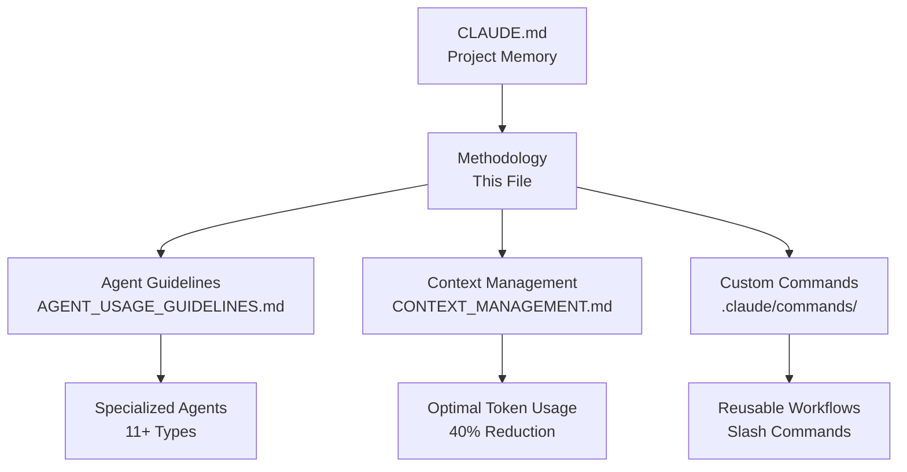

# YoutubeRag Development Methodology with Claude Code

**Version:** 2.0
**Last Updated:** January 2025
**Status:** 🟢 Active - Production Ready

---

## 📋 Table of Contents

1. [Overview](#overview)
2. [Core Principles](#core-principles)
3. [Workflow Patterns](#workflow-patterns)
4. [Agent Delegation Strategy](#agent-delegation-strategy)
5. [Context Management](#context-management)
6. [Git & GitHub Integration](#git--github-integration)
7. [Testing Strategy](#testing-strategy)
8. [Quality Assurance](#quality-assurance)
9. [Performance & Optimization](#performance--optimization)
10. [Team Collaboration](#team-collaboration)

---

## Overview

This methodology integrates **Claude Code best practices** with **YoutubeRag's specialized agent workflows** to create a highly efficient, collaborative development environment.

### Key Integration Points



---

## Core Principles

### 1. **Explore → Plan → Code → Commit**

This is the foundational workflow pattern from Claude Code best practices:

```bash
# Phase 1: EXPLORE (No Code Yet)
- Read relevant files, images, documentation
- Understand the problem domain deeply
- Ask clarifying questions
- Use /clear to reset context if needed

# Phase 2: PLAN (Extended Thinking)
- Use "think harder" or "ultrathink" for complex problems
- Document plan in .md file or GitHub issue
- Get stakeholder approval if needed
- Create TODO checklist for tracking

# Phase 3: CODE (Implementation)
- Implement with explicit verification steps
- Run tests continuously (TDD approach)
- Use subagents for parallel work
- Iterate based on feedback

# Phase 4: COMMIT (Documentation & Integration)
- Write contextual commit messages
- Update documentation
- Create PR with detailed description
- Run final quality checks
```

### 2. **Maximum Parallelism via Agent Delegation**

**Rule:** Always prefer delegating to specialized agents over doing work sequentially.

**Why:** Reduces total time by 40-60% through concurrent execution.

**See:** [AGENT_USAGE_GUIDELINES.md](AGENT_USAGE_GUIDELINES.md) for detailed agent usage.

### 3. **Context as a Precious Resource**

**Token Budget Management:**
- Use `/clear` between major task switches
- Load only relevant files into context
- Use subagents to preserve main context
- Leverage focused context windows

**See:** [CONTEXT_MANAGEMENT.md](CONTEXT_MANAGEMENT.md) for optimization strategies.

### 4. **Specificity Drives Results**

```diff
❌ BAD:  "Add tests for VideoService"
✅ GOOD: "Write integration tests for VideoService covering:
         - Video download with invalid URL (expect ValidationException)
         - Video processing when disk space < 1GB (expect DiskSpaceException)
         - Concurrent processing of 5 videos
         - Avoid mocks; use real database via TestContainers"
```

### 5. **Visual & Concrete Targets**

Provide concrete targets for iteration:
- ✅ Test cases with expected input/output
- ✅ Screenshots of desired UI state
- ✅ Performance benchmarks (e.g., "API response < 200ms")
- ✅ Code examples from similar implementations
- ❌ Vague descriptions without measurable outcomes

---

## Workflow Patterns

### Pattern 1: Feature Development (Epic-Based)

```markdown
## Epic Implementation Workflow

1. **Epic Validation** (Agent Delegation)
   └─ Delegate to: software-architect or dotnet-backend-developer
   └─ Output: Gap analysis, effort estimation
   └─ Duration: 1-2 hours

2. **Implementation Planning** (Extended Thinking)
   └─ Use: "think harder" mode
   └─ Create: Checklist in TODO.md or GitHub issue
   └─ Get: Stakeholder approval

3. **Parallel Implementation** (Multi-Agent)
   ├─ Agent 1: dotnet-backend-developer → Implements service layer
   ├─ Agent 2: test-engineer → Writes test suite
   └─ Agent 3: database-expert → Optimizes queries

4. **Code Review** (Quality Gate)
   └─ Delegate to: code-reviewer
   └─ Check: Security, performance, best practices

5. **Testing & Validation** (Quality Assurance)
   ├─ Run: Integration tests (422+ tests)
   ├─ Run: E2E tests in CI
   └─ Execute: Manual testing scenarios

6. **Commit & Release** (Git Workflow)
   └─ Create: Detailed commit message
   └─ Push: To feature branch
   └─ Create: PR with Epic context
```

### Pattern 2: Bug Fix Workflow

```markdown
## Bug Fix Workflow

1. **Investigation** (Root Cause Analysis)
   └─ Ask: "What could cause this behavior?"
   └─ Search: git log for related changes
   └─ Review: Related test failures

2. **Test-Driven Fix** (TDD)
   ├─ Write: Failing test that reproduces bug
   ├─ Commit: Test suite with failing test
   ├─ Implement: Fix to make test pass
   └─ Verify: All tests green

3. **Regression Prevention**
   └─ Add: Additional edge case tests
   └─ Document: Root cause in commit message
   └─ Update: CLAUDE.md if pattern found
```

### Pattern 3: Refactoring Workflow

```markdown
## Safe Refactoring Workflow

1. **Baseline** (Ensure Green State)
   └─ Run: All tests (must be 100% passing)
   └─ Commit: Current state as checkpoint

2. **Plan Refactoring** (Architecture Review)
   └─ Delegate to: software-architect
   └─ Document: Expected improvements
   └─ Identify: Risk areas

3. **Incremental Changes** (Small Steps)
   ├─ Refactor: One class/method at a time
   ├─ Test: After each change
   └─ Commit: Frequently with descriptive messages

4. **Performance Validation**
   └─ Run: Performance tests
   └─ Compare: Before/after metrics
   └─ Document: Improvements
```

---

## Agent Delegation Strategy

### When to Delegate (Decision Tree)

```
Does a specialized agent exist for this task?
├─ YES
│  └─ Will the task take >30 minutes?
│     ├─ YES → DELEGATE IMMEDIATELY
│     └─ NO
│        └─ Can I work on something else while agent works?
│           ├─ YES → DELEGATE (Parallel work)
│           └─ NO → Consider doing directly
└─ NO → Do task directly
```

### Available Specialized Agents

See [AGENT_USAGE_GUIDELINES.md](AGENT_USAGE_GUIDELINES.md) for complete list and usage examples.

**Most Frequently Used:**
1. `dotnet-backend-developer` - .NET/C# implementation
2. `test-engineer` - Test writing and execution
3. `code-reviewer` - Quality assurance
4. `software-architect` - Design decisions
5. `devops-engineer` - CI/CD and infrastructure

---

## Context Management

### Context Window Optimization

**Problem:** Claude has a finite context window. Irrelevant information reduces effectiveness.

**Solution:** Aggressive context management

```bash
# Clear context between major tasks
/clear

# Load only essential files
# Use tab-completion to reference specific files
@src/Services/VideoService.cs
@tests/Integration/VideoServiceTests.cs

# Use subagents for parallel work (preserves main context)
# Main context: Working on Feature A
# Subagent context: Reviewing Feature B
```

### File Loading Best Practices

```markdown
✅ DO:
- Use @filename for specific files
- Use /clear between unrelated tasks
- Request file reads explicitly when needed
- Use subagents for exploratory work

❌ DON'T:
- Load entire directories into context
- Keep old conversation history indefinitely
- Mix multiple unrelated tasks in one session
- Assume Claude remembers previous sessions
```

### Token Budget Guidelines

| Task Type | Recommended Context Size | Strategy |
|-----------|-------------------------|----------|
| Bug Fix | Small (1-3 files) | Focused investigation |
| Feature Development | Medium (5-10 files) | Incremental loading |
| Architecture Review | Large (project-wide) | Use subagents for exploration |
| Refactoring | Medium (affected files only) | Work in small batches |

---

## Git & GitHub Integration

### Commit Message Standards

Claude generates contextually-appropriate commit messages. Follow this format:

```
<type>(<scope>): <subject>

<body>

<footer>
```

**Types:**
- `feat`: New feature
- `fix`: Bug fix
- `refactor`: Code restructuring
- `test`: Adding tests
- `docs`: Documentation
- `chore`: Maintenance tasks
- `perf`: Performance improvements

**Example:**
```
feat(video-processing): Add progress tracking to transcription job

- Implemented IProgressTracker in TranscriptionJobProcessor
- Added progress updates at 25%, 50%, 75%, 100%
- Updated TranscriptionHub to broadcast progress via SignalR

Closes #YRUS-0103
```

### PR Creation Workflow

```bash
# 1. Ensure branch is up-to-date
git fetch origin
git status

# 2. Push to feature branch
git push -u origin claude/work-in-progress-<session-id>

# 3. Create PR using gh CLI (via Claude)
# Claude automatically:
# - Analyzes commits since divergence from main
# - Generates comprehensive PR description
# - Includes test plan and validation checklist
# - Links related issues
```

### GitHub Operations via Claude

```markdown
✅ Claude can:
- Search git history: "Find when we added Hangfire support"
- Create commits with context: "Commit these changes with appropriate message"
- Handle complex operations: Rebase, conflict resolution, cherry-pick
- Create PRs: With full context from git log
- Review PRs: Analyze changes and suggest improvements
- Triage issues: Categorize and prioritize
```

---

## Testing Strategy

### Test-Driven Development (TDD)

**Mandatory for:**
- New features (Epic implementation)
- Bug fixes (regression prevention)
- Refactoring (safety net)

**Workflow:**
```markdown
1. Write test (emphasize "TDD" to avoid mocks)
2. Verify test fails without implementation
3. Commit test suite
4. Implement code to pass tests
5. Verify all tests pass
6. Use independent subagent to verify no overfitting
7. Commit working code
```

### Test Coverage Standards

**Current Status:** 99.3% (422/425 tests passing)

**Target:** >95% for all new code

**Quality Metrics:**
- Unit Tests: Cover business logic, edge cases
- Integration Tests: Cover API endpoints, service interactions
- E2E Tests: Cover critical user workflows
- Performance Tests: Validate SLAs (API < 200ms, transcription throughput)

### Testing Tools

```bash
# Run all tests
dotnet test

# Run with coverage
dotnet test --collect:"XPlat Code Coverage"

# Run specific category
dotnet test --filter "Category=Integration"

# Run in Release mode (CI simulation)
dotnet test --configuration Release
```

---

## Quality Assurance

### Code Review Checklist (Automated via code-reviewer agent)

```markdown
## Security
- [ ] No secrets in code
- [ ] Input validation on all endpoints
- [ ] SQL injection prevention (parameterized queries)
- [ ] Authentication/authorization checks

## Performance
- [ ] Database queries optimized (indexes used)
- [ ] Async/await used correctly
- [ ] No N+1 query problems
- [ ] Resource disposal (using statements)

## Best Practices
- [ ] SOLID principles followed
- [ ] Clean Architecture layers respected
- [ ] Error handling comprehensive
- [ ] Logging at appropriate levels

## Testing
- [ ] Unit tests for business logic
- [ ] Integration tests for endpoints
- [ ] Edge cases covered
- [ ] Mocks avoided where possible (use TestContainers)

## Documentation
- [ ] XML comments on public APIs
- [ ] README updated if needed
- [ ] CHANGELOG.md updated
- [ ] Architecture docs updated if design changed
```

### Pre-Commit Hooks (Husky.NET)

Automatically runs on every commit:
```bash
✅ Code formatting check (dotnet format)
✅ Build verification
✅ Unit tests (on pre-push)
```

---

## Performance & Optimization

### Performance Testing

```bash
# Smoke tests (quick validation)
./scripts/run-performance-tests.sh --smoke

# Full performance tests (k6)
./scripts/run-performance-tests.sh --full
```

### Monitoring & Metrics

**Prometheus Metrics Available:**
- API request rates and latencies
- Video processing metrics
- Transcription duration and throughput
- Database connection pool stats
- Cache hit/miss rates

**Grafana Dashboards:**
- Pre-configured dashboard with 14 panels
- See: [PROMETHEUS_METRICS.md](../docs/PROMETHEUS_METRICS.md)

### Optimization Strategies

```markdown
1. **Database Queries**
   └─ Delegate to: database-expert
   └─ Tools: EXPLAIN, indexes, query rewriting

2. **API Response Times**
   └─ Delegate to: backend-developer
   └─ Tools: Caching, async patterns, compression

3. **Memory Usage**
   └─ Delegate to: code-reviewer
   └─ Tools: Memory profilers, resource disposal checks

4. **Background Jobs**
   └─ Delegate to: backend-developer
   └─ Tools: Hangfire dashboard, job optimization
```

---

## Team Collaboration

### Onboarding New Team Members

**Step 1:** Share this methodology
```bash
# New developer runs:
git clone https://github.com/gustavoali/YoutubeRag.git
cd YoutubeRag

# Claude automatically loads .claude/CLAUDE.md
# Reads this methodology and project context
```

**Step 2:** Run automated setup
```bash
./scripts/dev-setup.sh  # Linux/macOS
# or
.\scripts\dev-setup.ps1  # Windows
```

**Step 3:** Review key files
- [CLAUDE.md](../CLAUDE.md) - Project memory
- [README.md](../README.md) - Getting started guide
- [AGENT_USAGE_GUIDELINES.md](AGENT_USAGE_GUIDELINES.md) - Agent delegation

### Shared Knowledge

**Checked into Git:**
- ✅ `.claude/CLAUDE.md` - Project-specific instructions
- ✅ `.claude/commands/` - Custom slash commands
- ✅ `.claude/METHODOLOGY.md` - This file
- ✅ `.mcp.json` - MCP server configuration (if added)

**Personal (Not in Git):**
- ⚙️ `~/.claude/CLAUDE.md` - Personal preferences
- ⚙️ `.claude/settings.local.json` - Local permissions

### Communication Patterns

**During Development:**
```markdown
# Always communicate context in commits
git commit -m "feat(auth): Add JWT token refresh endpoint

Implemented token refresh flow:
- Added RefreshTokenAsync method to AuthService
- Created /api/auth/refresh endpoint
- Added refresh token validation
- Updated tests to cover refresh scenarios

Related to Epic 5 (YRUS-0501)
Part of authentication improvements sprint"
```

**In Pull Requests:**
```markdown
# Claude generates comprehensive PR descriptions
## Summary
- [Clear bullet points of changes]

## Test Plan
- [Checklist of validation steps]

## Performance Impact
- [Metrics if applicable]

## Breaking Changes
- [List any breaking changes]
```

---

## Quick Reference

### Most Common Commands

```bash
# Clear context (use frequently!)
/clear

# Initialize Claude.md
/init

# View/modify permissions
/permissions

# Custom commands (if configured)
/review-epic <epic-number>
/run-tests <category>
/analyze-performance
```

### When in Doubt

1. **Check CLAUDE.md** - Project-specific guidance
2. **Review AGENT_USAGE_GUIDELINES.md** - Can I delegate this?
3. **Use /clear** - Start fresh if context is polluted
4. **Think harder** - Complex problems need extended thinking
5. **Ask Claude** - "How does X work in this codebase?"

---

## Version History

| Version | Date | Changes |
|---------|------|---------|
| 2.0 | January 2025 | Integrated Claude Code best practices with agent delegation |
| 1.0 | October 2024 | Initial agent-based methodology |

---

## Related Documentation

- [CLAUDE.md](../CLAUDE.md) - Project memory (auto-loaded by Claude)
- [AGENT_USAGE_GUIDELINES.md](AGENT_USAGE_GUIDELINES.md) - Detailed agent usage
- [CONTEXT_MANAGEMENT.md](CONTEXT_MANAGEMENT.md) - Token optimization strategies
- [README.md](../README.md) - Project overview and quick start
- [DEVELOPER_SETUP_GUIDE.md](../docs/devops/DEVELOPER_SETUP_GUIDE.md) - Detailed setup
- [DEVOPS_IMPLEMENTATION_PLAN.md](../docs/devops/DEVOPS_IMPLEMENTATION_PLAN.md) - DevOps roadmap

---

**Remember:** This methodology is a living document. Update it as the team learns and evolves. Use `#` during Claude sessions to suggest improvements.
