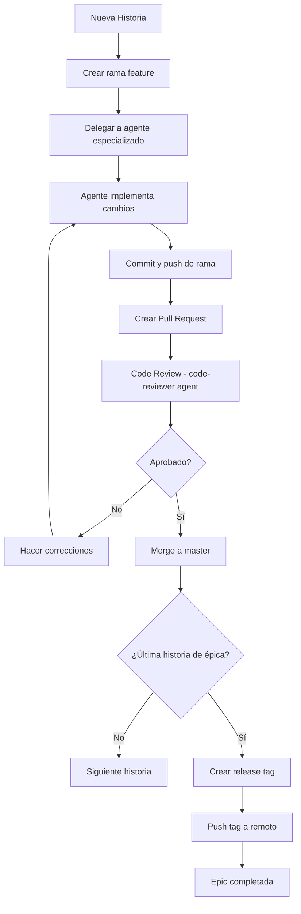

# Metodología de Desarrollo - YoutubeRag.NET

**Estado**: Activo y Obligatorio
**Última actualización**: 2025-10-11
**Propietario**: Equipo de Desarrollo

---

## 📋 Tabla de Contenidos

- [Introducción](#introducción)
- [Reglas Invariables](#reglas-invariables)
- [Git Workflow](#git-workflow)
- [Delegación a Agentes Especializados](#delegación-a-agentes-especializados)
- [Releases y Versionado](#releases-y-versionado)
- [Ejemplos Completos](#ejemplos-completos)
- [Checklist por Historia](#checklist-por-historia)

---

## Introducción

Este documento define la **metodología de desarrollo obligatoria** para el proyecto YoutubeRag.NET. Todas las historias de usuario, tareas, y cambios al código deben seguir estas reglas sin excepción.

### Principios Fundamentales

1. **Una rama por historia de usuario** - Aislamiento completo de cambios
2. **Delegación a agentes especializados** - Expertise y calidad
3. **Release por épica completada** - Versionado semántico
4. **Revisión de código obligatoria** - Calidad asegurada
5. **Tests antes de merge** - No romper master

---

## Reglas Invariables

### ⚠️ REGLA 1: Ramas Independientes por Historia

**NUNCA trabajar directamente en master/develop**

Cada historia de usuario debe tener su propia rama feature:

```bash
# ❌ INCORRECTO - Trabajar directamente en master
git checkout master
# hacer cambios...
git commit -m "STORY-001: Feature"
git push origin master

# ✅ CORRECTO - Crear rama feature
git checkout master
git pull origin master
git checkout -b feature/STORY-001-descripcion-corta
# hacer cambios...
git commit -m "STORY-001: Descripción detallada"
git push origin feature/STORY-001-descripcion-corta
```

**Nomenclatura de ramas:**
- `feature/STORY-ID-descripcion` - Nuevas funcionalidades
- `fix/STORY-ID-descripcion` - Bug fixes
- `refactor/STORY-ID-descripcion` - Refactorización
- `docs/STORY-ID-descripcion` - Solo documentación
- `test/STORY-ID-descripcion` - Solo tests

### ⚠️ REGLA 2: Delegación Obligatoria a Agentes

**Usar agentes especializados según el tipo de trabajo:**

| Tipo de Trabajo | Agente Especializado | Cuándo Usar |
|----------------|---------------------|-------------|
| **Backend .NET** | `dotnet-backend-developer-sonnet` | APIs, Entity Framework, servicios C#, middleware |
| **DevOps** | `devops-engineer` | CI/CD, Docker, K8s, infraestructura, monitoreo |
| **Testing** | `test-engineer` | Unit tests, integration tests, test automation |
| **Database** | `database-expert` | Schemas, migraciones, queries, optimización |
| **Code Review** | `code-reviewer` | Revisar PRs, quality gates, security |
| **Frontend React** | `frontend-react-developer` | Componentes React, Next.js, UI |
| **Product** | `product-owner` | User stories, backlog, priorización |
| **Project Mgmt** | `project-manager` | Planning, tracking, reportes |

**Ejemplo de delegación:**

```markdown
# Historia BACKEND-045: Implementar autenticación JWT

## Paso 1: Delegar a dotnet-backend-developer-sonnet
"Implementar autenticación JWT para la API con:
- Generación de tokens con claims personalizados
- Validación de tokens en middleware
- Refresh tokens con Redis
- Tests unitarios completos"

## Paso 2: Delegar a test-engineer (si necesario)
"Crear tests de integración para flujo completo de autenticación"

## Paso 3: Delegar a code-reviewer
"Revisar implementación de autenticación JWT en feature/BACKEND-045-jwt-auth"
```

### ⚠️ REGLA 3: Release por Épica Completada

Al completar todas las historias de una épica:

```bash
# 1. Asegurar que master está actualizado
git checkout master
git pull origin master

# 2. Crear tag de release con mensaje descriptivo
git tag -a v1.2.0 -m "Release: Epic - Video Transcription with Whisper

Completed user stories:
- BACKEND-040: Integrate Whisper.NET library (8 pts)
- BACKEND-041: Implement transcription service (5 pts)
- BACKEND-042: Add transcription endpoints (3 pts)
- BACKEND-043: Store transcriptions in database (3 pts)
- DEVOPS-015: Setup Whisper model storage (2 pts)

Total: 21 story points
Breaking changes: None
"

# 3. Push tag al remoto
git push origin v1.2.0

# 4. Crear GitHub Release (opcional pero recomendado)
gh release create v1.2.0 \
  --title "v1.2.0 - Video Transcription with Whisper" \
  --notes "See tag message for details" \
  --target master
```

**Versionado Semántico (SemVer):**
- `v1.0.0` → `v1.1.0`: Nueva épica con features (MINOR)
- `v1.1.0` → `v1.1.1`: Bugfixes solamente (PATCH)
- `v1.x.x` → `v2.0.0`: Breaking changes (MAJOR)

---

## Git Workflow

### Flujo Completo por Historia de Usuario



### Comandos por Fase

#### Fase 1: Inicio de Historia

```bash
# 1. Actualizar master
git checkout master
git pull origin master

# 2. Crear rama feature desde master actualizado
git checkout -b feature/BACKEND-045-jwt-authentication

# 3. Verificar que estás en la rama correcta
git branch --show-current
# Output: feature/BACKEND-045-jwt-authentication
```

#### Fase 2: Desarrollo (con agente)

```bash
# Delegar trabajo al agente apropiado
# El agente hace cambios, commits parciales si es necesario

# Verificar cambios
git status
git diff

# Commit final de la historia
git add .
git commit -m "BACKEND-045: Implement JWT authentication with refresh tokens

- Add JwtService for token generation and validation
- Implement AuthMiddleware for request authentication
- Add Redis integration for refresh token storage
- Include comprehensive unit tests (95% coverage)
- Update API documentation with auth examples

🤖 Generated with [Claude Code](https://claude.com/claude-code)

Co-Authored-By: Claude <noreply@anthropic.com>
"
```

#### Fase 3: Push y Pull Request

```bash
# Push rama al remoto
git push origin feature/BACKEND-045-jwt-authentication

# Crear Pull Request con gh CLI
gh pr create \
  --title "BACKEND-045: Implement JWT authentication" \
  --body "## Summary
- Implements JWT token generation with custom claims
- Adds refresh token mechanism using Redis
- Includes middleware for request authentication
- 95% test coverage

## Testing
- ✅ All unit tests passing (24/24)
- ✅ Integration tests passing (8/8)
- ✅ Manual testing completed

## Checklist
- [x] Tests added and passing
- [x] Documentation updated
- [x] No breaking changes
- [x] Security review completed

🤖 Generated with [Claude Code](https://claude.com/claude-code)
" \
  --base master \
  --head feature/BACKEND-045-jwt-authentication
```

#### Fase 4: Code Review

```bash
# Delegar review a code-reviewer agent
# Si hay cambios solicitados, hacer commits adicionales:

git add .
git commit -m "fix: Address code review feedback

- Extract token expiration to configuration
- Add input validation for refresh token
- Improve error messages"
git push origin feature/BACKEND-045-jwt-authentication

# El PR se actualiza automáticamente
```

#### Fase 5: Merge

```bash
# Después de aprobación, merge del PR
# (Preferiblemente desde la UI de GitHub para mantener historial)

# Desde línea de comandos (si es necesario):
gh pr merge feature/BACKEND-045-jwt-authentication \
  --squash \
  --delete-branch

# Actualizar tu master local
git checkout master
git pull origin master

# Limpiar ramas locales merged
git branch -d feature/BACKEND-045-jwt-authentication
```

#### Fase 6: Release (al completar épica)

```bash
# Si esta fue la última historia de la épica:
git tag -a v1.5.0 -m "Release: Epic - User Authentication

Completed Stories:
- BACKEND-045: JWT authentication (8 pts)
- BACKEND-046: OAuth2 integration (5 pts)
- BACKEND-047: Password reset flow (3 pts)
- BACKEND-048: Session management (3 pts)

Total: 19 story points"

git push origin v1.5.0

gh release create v1.5.0 \
  --title "v1.5.0 - User Authentication" \
  --notes "Complete user authentication system with JWT, OAuth2, and session management." \
  --target master
```

---

## Delegación a Agentes Especializados

### Principio de Delegación

**Siempre delegar cuando:**
- El trabajo requiere expertise específico
- La tarea es compleja (>3 story points)
- Se necesita mantener patrones consistentes
- Hay múltiples archivos a modificar

**Ejemplos de delegación correcta:**

### Ejemplo 1: Backend Development

```markdown
Historia: BACKEND-052 - Implementar exportación de transcripciones a PDF

✅ CORRECTO:
1. Usar TodoWrite para planear:
   - Instalar biblioteca PDF (iText7)
   - Crear ExportService
   - Implementar generador de PDF
   - Agregar endpoint API
   - Escribir tests

2. Delegar a dotnet-backend-developer-sonnet:
   "Implementar exportación de transcripciones a PDF:
   - Instalar iText7.Core 8.0.2
   - Crear YoutubeRag.Application/Services/ExportService.cs
   - Método GeneratePdfAsync(Transcription, Stream)
   - Incluir metadata, timestamps, y formato
   - Endpoint POST /api/transcriptions/{id}/export/pdf
   - Unit tests con mock de PDF writer"

3. El agente implementa todo el flujo completo
4. Commit y push de rama feature
```

### Ejemplo 2: DevOps Work

```markdown
Historia: DEVOPS-030 - Configurar auto-scaling en Kubernetes

✅ CORRECTO:
1. Delegar a devops-engineer:
   "Configurar Horizontal Pod Autoscaler para YoutubeRag API:
   - HPA basado en CPU (70%) y memoria (80%)
   - Min replicas: 2, Max replicas: 10
   - Configurar métricas custom (request rate)
   - Actualizar deployment manifests
   - Documentar en docs/KUBERNETES.md
   - Tests de carga con k6"

2. El agente crea todos los manifests y documentación
3. Agente hace testing de configuración
```

### Ejemplo 3: Testing

```markdown
Historia: TEST-015 - Agregar tests de integración para video pipeline

✅ CORRECTO:
1. Delegar a test-engineer:
   "Crear suite completa de integration tests para video pipeline:
   - Tests de descarga de YouTube
   - Tests de extracción de audio
   - Tests de transcripción con Whisper
   - Tests de embeddings y vectorización
   - Setup/teardown con test containers
   - Min 90% coverage del pipeline completo"

2. El agente crea estructura de tests y fixtures
3. El agente configura test containers y mocks necesarios
```

### Tabla de Decisión: ¿Cuándo Delegar?

| Situación | ¿Delegar? | Agente |
|-----------|-----------|--------|
| Crear nuevo endpoint API REST | ✅ Sí | dotnet-backend-developer-sonnet |
| Agregar campo a Entity Framework model | ✅ Sí | dotnet-backend-developer-sonnet |
| Escribir unit tests para servicio | ✅ Sí | test-engineer |
| Configurar pipeline de GitHub Actions | ✅ Sí | devops-engineer |
| Optimizar query SQL lenta | ✅ Sí | database-expert |
| Crear componente React | ✅ Sí | frontend-react-developer |
| Revisar PR antes de merge | ✅ Sí | code-reviewer |
| Actualizar README | ⚠️ Opcional | (puede hacerse directamente) |
| Cambiar configuración simple | ⚠️ Opcional | (puede hacerse directamente) |
| Renombrar variable | ❌ No | (cambio trivial) |

---

## Releases y Versionado

### Estrategia de Release

**Releases se crean:**
- ✅ Al completar una épica completa
- ✅ Al acumular 15+ story points merged
- ✅ Antes de deploy a producción
- ✅ Para marcar hitos importantes

**Releases NO se crean:**
- ❌ Por cada historia individual
- ❌ Por cambios de documentación
- ❌ Por fixes menores (a menos que sean hotfixes)

### Formato de Tag

```
v{MAJOR}.{MINOR}.{PATCH}

Ejemplos:
- v1.0.0: Initial release
- v1.1.0: Nueva épica (features)
- v1.1.1: Bugfixes
- v2.0.0: Breaking changes
```

### Mensaje de Tag Detallado

```bash
git tag -a v1.6.0 -m "Release: Epic - Advanced Search Capabilities

## Completed Stories
- BACKEND-055: Implement full-text search with Elasticsearch (8 pts)
- BACKEND-056: Add semantic search with vector embeddings (8 pts)
- BACKEND-057: Create search filters and facets (5 pts)
- BACKEND-058: Optimize search performance (3 pts)

## Summary
Total: 24 story points
Features: 4 new features
Breaking changes: None
Database migrations: 2 migrations

## Testing
- Unit tests: 156 tests, 94% coverage
- Integration tests: 32 tests, all passing
- Performance tests: Sub-200ms p95 latency

## Dependencies Updated
- Elasticsearch.Net 8.12.0
- OpenAI SDK 1.8.0

## Contributors
- @gustavoali
- Claude (AI Assistant)
"
```

### GitHub Releases

Crear GitHub Release asociado al tag:

```bash
gh release create v1.6.0 \
  --title "v1.6.0 - Advanced Search Capabilities" \
  --notes-file RELEASE_NOTES.md \
  --target master \
  --latest

# RELEASE_NOTES.md contiene:
# - What's New
# - Breaking Changes (si aplica)
# - Migration Guide (si aplica)
# - Full Changelog
```

---

## Ejemplos Completos

### Ejemplo 1: Historia Simple (3 story points)

**Historia**: BACKEND-060 - Agregar campo `tags` a entidad Video

```bash
# 1. Crear rama
git checkout master && git pull
git checkout -b feature/BACKEND-060-add-video-tags

# 2. Delegar a agente
# Task para dotnet-backend-developer-sonnet:
# "Agregar campo 'tags' (List<string>) a Video entity:
# - Actualizar YoutubeRag.Domain/Entities/Video.cs
# - Crear migración EF Core
# - Actualizar VideoDto y mapping
# - Agregar validación (max 10 tags, 50 chars cada uno)
# - Unit tests para validación"

# 3. Agente implementa cambios

# 4. Commit y push
git add .
git commit -m "BACKEND-060: Add tags field to Video entity"
git push origin feature/BACKEND-060-add-video-tags

# 5. PR
gh pr create --title "BACKEND-060: Add tags to Video" --body "..."

# 6. Review y merge (no crear release, es historia individual)
```

### Ejemplo 2: Épica Completa (Sprint)

**Épica**: Video Recommendations (20 story points, 4 historias)

```bash
# Historia 1: BACKEND-070 (8 pts)
git checkout master && git pull
git checkout -b feature/BACKEND-070-recommendation-engine
# Delegar a dotnet-backend-developer-sonnet
# ... implementar ...
git commit -m "BACKEND-070: Implement recommendation engine"
git push origin feature/BACKEND-070-recommendation-engine
gh pr create ...
# Merge PR

# Historia 2: BACKEND-071 (5 pts)
git checkout master && git pull
git checkout -b feature/BACKEND-071-similarity-algorithm
# Delegar a dotnet-backend-developer-sonnet
# ... implementar ...
git commit -m "BACKEND-071: Add content similarity algorithm"
git push origin feature/BACKEND-071-similarity-algorithm
gh pr create ...
# Merge PR

# Historia 3: BACKEND-072 (4 pts)
git checkout master && git pull
git checkout -b feature/BACKEND-072-recommendation-api
# Delegar a dotnet-backend-developer-sonnet
# ... implementar ...
git commit -m "BACKEND-072: Create recommendations API endpoints"
git push origin feature/BACKEND-072-recommendation-api
gh pr create ...
# Merge PR

# Historia 4: TEST-020 (3 pts)
git checkout master && git pull
git checkout -b test/TEST-020-recommendation-tests
# Delegar a test-engineer
# ... implementar tests ...
git commit -m "TEST-020: Add integration tests for recommendations"
git push origin test/TEST-020-recommendation-tests
gh pr create ...
# Merge PR

# ✅ ÉPICA COMPLETADA - CREAR RELEASE
git checkout master && git pull
git tag -a v1.8.0 -m "Release: Epic - Video Recommendations

Completed Stories:
- BACKEND-070: Recommendation engine (8 pts)
- BACKEND-071: Similarity algorithm (5 pts)
- BACKEND-072: Recommendations API (4 pts)
- TEST-020: Integration tests (3 pts)

Total: 20 story points
Features: Personalized video recommendations
Breaking changes: None
"

git push origin v1.8.0
gh release create v1.8.0 --title "v1.8.0 - Video Recommendations" --notes "..."
```

### Ejemplo 3: Hotfix Urgente

**Situación**: Bug crítico en producción (v2.1.0)

```bash
# 1. Crear rama hotfix desde tag de producción
git checkout v2.1.0
git checkout -b hotfix/v2.1.1-fix-auth-token-expiry

# 2. Delegar fix a dotnet-backend-developer-sonnet
# "Fix JWT token expiration bug:
# - Corregir cálculo de expiry time
# - Agregar validación de timezone
# - Test que reproduzca el bug
# - Test que valide el fix"

# 3. Implementar fix

# 4. Commit
git commit -m "fix: Correct JWT token expiration calculation

Fixes #234 - Tokens were expiring immediately due to UTC conversion bug"

# 5. Merge a master
git checkout master
git merge hotfix/v2.1.1-fix-auth-token-expiry --no-ff

# 6. Tag hotfix release
git tag -a v2.1.1 -m "Hotfix: Fix JWT token expiration bug

Fixes:
- JWT tokens expiring immediately
- UTC timezone conversion error

Critical: Yes
Deployment required: Immediate"

git push origin master v2.1.1

# 7. Cherry-pick a otras ramas si es necesario
git checkout develop
git cherry-pick <commit-hash>
```

---

## Checklist por Historia

### ✅ Checklist de Inicio

- [ ] Historia definida con criterios de aceptación claros
- [ ] Story points estimados
- [ ] Rama master actualizada (`git pull`)
- [ ] Rama feature creada con nomenclatura correcta
- [ ] Verificado que estoy en la rama feature (`git branch --show-current`)

### ✅ Checklist de Desarrollo

- [ ] Trabajo delegado al agente especializado apropiado
- [ ] Agente implementó todos los criterios de aceptación
- [ ] Tests creados (unit, integration según aplique)
- [ ] Documentación actualizada si es necesario
- [ ] Pre-commit hooks pasaron (formato, build, tests)

### ✅ Checklist Pre-Commit

- [ ] Código revisado manualmente
- [ ] `dotnet build` exitoso
- [ ] `dotnet test` todos pasando
- [ ] No hay `console.log` o código de debug
- [ ] No hay secretos o credenciales hardcoded
- [ ] Mensaje de commit descriptivo y sigue formato

### ✅ Checklist Pre-Push

- [ ] Commits hacen sentido lógico (no hay "fix typo" x10)
- [ ] Branch actualizado con master si hay conflicts
- [ ] Cambios no rompen funcionalidad existente
- [ ] Ready para code review

### ✅ Checklist de Pull Request

- [ ] PR title descriptivo: `STORY-ID: Short description`
- [ ] PR body completo con:
  - [ ] Summary de cambios
  - [ ] Test plan
  - [ ] Screenshots (si UI)
  - [ ] Breaking changes (si aplica)
- [ ] Assignees y reviewers agregados
- [ ] Labels apropiados (feature, bugfix, etc.)
- [ ] CI/CD pipeline pasando

### ✅ Checklist de Code Review

- [ ] Code review solicitado a `code-reviewer` agent
- [ ] Todos los comentarios del review atendidos
- [ ] Cambios adicionales committed y pushed
- [ ] Re-review si cambios fueron significativos
- [ ] Aprobación explícita recibida

### ✅ Checklist de Merge

- [ ] PR aprobado por reviewer
- [ ] CI/CD checks todos en verde
- [ ] Conflicts resueltos si los hay
- [ ] Merge realizado (preferir squash para historia limpia)
- [ ] Rama feature eliminada después del merge
- [ ] Master local actualizado con pull

### ✅ Checklist de Release (al completar épica)

- [ ] Todas las historias de la épica merged a master
- [ ] Versión nueva decidida (MAJOR.MINOR.PATCH)
- [ ] Tag creado con mensaje detallado
- [ ] Tag pushed a remoto
- [ ] GitHub Release creado con release notes
- [ ] Release notes comunican:
  - [ ] Qué cambió (features, fixes)
  - [ ] Breaking changes (si hay)
  - [ ] Migration guide (si aplica)
  - [ ] Contributors reconocidos

---

## Excepciones y Casos Especiales

### Caso 1: Cambios Urgentes Menores

**Situación**: Typo en documentación, config simple, etc.

**Permitido**: Commit directo a master SI Y SOLO SI:
- Cambio es <= 5 líneas
- No afecta código ejecutable
- Es documentación o configuración
- Es realmente urgente

**Ejemplo permitido**:
```bash
git checkout master
# Corregir typo en README.md
git commit -m "docs: Fix typo in README installation section"
git push origin master
```

### Caso 2: Múltiples Historias Interdependientes

**Situación**: Historia B depende completamente de Historia A

**Solución 1 (Preferida)**: Combinar en una sola historia más grande

**Solución 2**: Branch encadenado
```bash
# Historia A
git checkout -b feature/BACKEND-080-base-service
# implementar A
git commit -m "BACKEND-080: Base service"
git push origin feature/BACKEND-080-base-service

# Historia B (desde A, no desde master)
git checkout feature/BACKEND-080-base-service
git checkout -b feature/BACKEND-081-extended-service
# implementar B
git commit -m "BACKEND-081: Extended service"
git push origin feature/BACKEND-081-extended-service

# PRs en orden: A primero, luego B
```

### Caso 3: Refactoring Masivo

**Situación**: Necesita refactor de 20+ archivos

**Solución**: Crear épica de refactoring, dividir en historias lógicas
```
REFACTOR-001: Rename entities (8 pts)
REFACTOR-002: Update services (5 pts)
REFACTOR-003: Update tests (3 pts)
REFACTOR-004: Update documentation (2 pts)
```

Seguir mismo proceso de ramas independientes.

---

## Troubleshooting

### Problema: Olvidé crear rama feature

```bash
# Situación: Ya hice cambios en master
git status  # shows modified files

# Solución: Stash, crear rama, apply stash
git stash
git checkout -b feature/STORY-XXX-description
git stash pop
# Continuar normalmente
```

### Problema: Necesito actualizar mi rama con cambios de master

```bash
# Opción 1: Rebase (historial limpio, preferido)
git checkout feature/my-branch
git fetch origin
git rebase origin/master

# Si hay conflictos:
# - Resolver conflicts
git add .
git rebase --continue

# Opción 2: Merge (historial con merge commit)
git checkout feature/my-branch
git merge origin/master
```

### Problema: Commit en rama equivocada

```bash
# Situación: Commit en master, debió ser en feature branch
git log  # ver el commit hash
git checkout -b feature/correct-branch  # crear branch correcta
git checkout master
git reset --hard HEAD~1  # eliminar commit de master (CUIDADO!)
git checkout feature/correct-branch  # commit ya está aquí
```

### Problema: PR tiene muchos commits pequeños

```bash
# Solución: Squash antes de merge
# Opción 1: Al hacer merge en GitHub, usar "Squash and merge"

# Opción 2: Interactive rebase local
git checkout feature/my-branch
git rebase -i master

# En editor, cambiar 'pick' a 'squash' para commits a combinar
# Editar mensaje de commit final
git push origin feature/my-branch --force
```

---

## Referencias

- [Git Flow Cheat Sheet](https://danielkummer.github.io/git-flow-cheatsheet/)
- [Semantic Versioning 2.0.0](https://semver.org/)
- [Conventional Commits](https://www.conventionalcommits.org/)
- [GitHub Flow](https://guides.github.com/introduction/flow/)
- [Atlassian Git Tutorials](https://www.atlassian.com/git/tutorials)

---

## Changelog del Documento

### v1.0.0 - 2025-10-11
- ✅ Documento inicial creado
- ✅ Reglas invariables definidas
- ✅ Git workflow documentado
- ✅ Delegación a agentes especificada
- ✅ Proceso de releases definido
- ✅ Ejemplos completos agregados
- ✅ Checklists creados
- ✅ Troubleshooting incluido

---

**🚨 RECORDATORIO FINAL: Estas reglas son INVARIABLES y OBLIGATORIAS para todo el equipo.**

No hay excepciones sin aprobación explícita del tech lead. Cada violación debe ser documentada y justificada.
