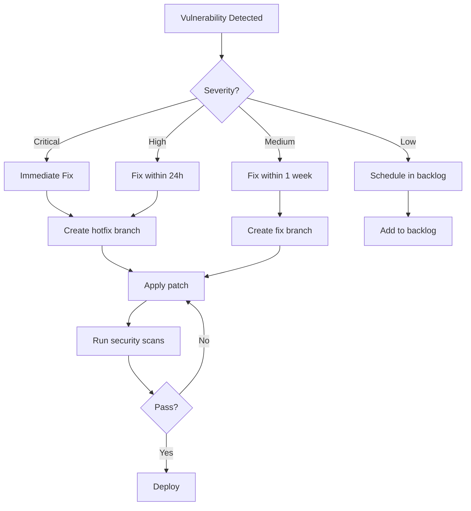

# Security Guide - YoutubeRag.NET

Comprehensive security documentation for developers and security teams.

## 📋 Table of Contents

- [Security Overview](#security-overview)
- [Security Pipeline](#security-pipeline)
- [Configuration](#configuration)
- [Best Practices](#best-practices)
- [Vulnerability Management](#vulnerability-management)
- [Security Checklist](#security-checklist)
- [Incident Response](#incident-response)

## Security Overview

YoutubeRag.NET implements a comprehensive security strategy covering multiple layers:

### 🛡️ Security Layers

1. **Code Security (SAST)**
   - CodeQL static analysis
   - Security Code Scan for .NET
   - Semgrep security rules

2. **Dependency Security**
   - NuGet vulnerability scanning
   - OWASP Dependency Check
   - Snyk analysis (optional)

3. **Container Security**
   - Trivy container scanning
   - Grype vulnerability detection
   - Docker Scout CVE analysis

4. **Secret Detection**
   - GitLeaks secret scanning
   - TruffleHog verification

5. **IaC Security**
   - Checkov infrastructure scanning
   - Terrascan policy enforcement

6. **License Compliance**
   - Automated license checking
   - Prohibited license detection

## Security Pipeline

### Automated Scans

The security pipeline runs automatically:

- **On Every Push/PR**: Full security scan
- **Daily (2 AM UTC)**: Scheduled security scan
- **On Demand**: Manual workflow dispatch

### Scan Jobs

```yaml
1. CodeQL Analysis          → Static code analysis
2. Dependency Scanning      → Vulnerable packages
3. Container Security       → Image vulnerabilities
4. Secret Scanning          → Exposed secrets
5. IaC Scanning            → Infrastructure issues
6. SAST                    → Application security
7. License Check           → License compliance
8. Security Summary        → Aggregated report
```

## Configuration

### Security Configuration File

The project uses `.security.yml` for centralized security configuration:

```yaml
# Example configuration
security:
  level: strict
  fail_on_critical: true
  fail_on_high: true
  fail_on_medium: false

dependencies:
  nuget:
    enabled: true
    severity_threshold: "high"

  owasp:
    enabled: true

containers:
  trivy:
    enabled: true
    severity: "CRITICAL,HIGH,MEDIUM"
```

### Severity Levels

| Severity | Build Impact | Alert |
|----------|-------------|-------|
| CRITICAL | ❌ Fails build | Immediate |
| HIGH | ❌ Fails build | Immediate |
| MEDIUM | ⚠️ Warning | Daily |
| LOW | ℹ️ Info | Weekly |

### Customizing Thresholds

Edit `.security.yml` to adjust security policies:

```yaml
# Fail build on medium severity
security:
  fail_on_medium: true

# Only scan for critical/high in containers
containers:
  trivy:
    severity: "CRITICAL,HIGH"
```

## Best Practices

### 1. Secure Coding Guidelines

#### Input Validation

```csharp
// ✅ GOOD: Validate all user input
public async Task<Video> GetVideo(int id)
{
    if (id <= 0)
        throw new ArgumentException("Invalid video ID");

    return await _repository.GetByIdAsync(id);
}

// ❌ BAD: No validation
public async Task<Video> GetVideo(int id)
{
    return await _repository.GetByIdAsync(id);
}
```

#### SQL Injection Prevention

```csharp
// ✅ GOOD: Use parameterized queries
var user = await _context.Users
    .FirstOrDefaultAsync(u => u.Email == email);

// ❌ BAD: String concatenation
var sql = $"SELECT * FROM Users WHERE Email = '{email}'";
var user = await _context.Users.FromSqlRaw(sql).FirstOrDefaultAsync();
```

#### XSS Prevention

```csharp
// ✅ GOOD: Encode output
public string GetUserName()
{
    return HttpUtility.HtmlEncode(user.Name);
}

// ❌ BAD: Raw output
public string GetUserName()
{
    return user.Name;  // Could contain <script> tags
}
```

### 2. Authentication & Authorization

#### Secure Authentication

```csharp
// ✅ GOOD: Strong password requirements
services.AddIdentity<User, Role>(options =>
{
    options.Password.RequireDigit = true;
    options.Password.RequireLowercase = true;
    options.Password.RequireUppercase = true;
    options.Password.RequireNonAlphanumeric = true;
    options.Password.RequiredLength = 12;
})
.AddEntityFrameworkStores<AppDbContext>();
```

#### JWT Configuration

```csharp
// ✅ GOOD: Secure JWT settings
services.AddAuthentication(JwtBearerDefaults.AuthenticationScheme)
    .AddJwtBearer(options =>
    {
        options.TokenValidationParameters = new TokenValidationParameters
        {
            ValidateIssuer = true,
            ValidateAudience = true,
            ValidateLifetime = true,
            ValidateIssuerSigningKey = true,
            ClockSkew = TimeSpan.Zero, // No tolerance
            IssuerSigningKey = new SymmetricSecurityKey(
                Encoding.UTF8.GetBytes(secretKey))
        };
    });
```

### 3. Dependency Management

#### Verify Package Sources

```xml
<!-- nuget.config -->
<packageSources>
  <clear />
  <add key="nuget.org" value="https://api.nuget.org/v3/index.json"
       protocolVersion="3" />
</packageSources>
```

#### Regular Updates

```bash
# Check for outdated packages
dotnet list package --outdated

# Update packages (test thoroughly!)
dotnet add package PackageName --version X.Y.Z
```

### 4. Secret Management

#### Environment Variables

```csharp
// ✅ GOOD: Use environment variables
var apiKey = Environment.GetEnvironmentVariable("API_KEY");
if (string.IsNullOrEmpty(apiKey))
    throw new InvalidOperationException("API_KEY not configured");

// ❌ BAD: Hardcoded secrets
var apiKey = "sk_live_abc123...";  // NEVER do this!
```

#### .gitignore Configuration

```gitignore
# Secrets
.env
appsettings.*.json
!appsettings.json
*.pfx
*.p12
secrets/
```

### 5. API Security Headers

```csharp
// Program.cs - Add security headers
app.Use(async (context, next) =>
{
    context.Response.Headers.Add("X-Content-Type-Options", "nosniff");
    context.Response.Headers.Add("X-Frame-Options", "DENY");
    context.Response.Headers.Add("X-XSS-Protection", "1; mode=block");
    context.Response.Headers.Add("Strict-Transport-Security",
        "max-age=31536000; includeSubDomains");
    context.Response.Headers.Add("Content-Security-Policy",
        "default-src 'self'");

    await next();
});
```

### 6. CORS Configuration

```csharp
// ✅ GOOD: Specific origins
services.AddCors(options =>
{
    options.AddPolicy("ProductionPolicy", builder =>
    {
        builder.WithOrigins("https://yourdomain.com")
               .AllowedMethods("GET", "POST")
               .AllowCredentials();
    });
});

// ❌ BAD: Allow any origin
services.AddCors(options =>
{
    options.AddDefaultPolicy(builder =>
    {
        builder.AllowAnyOrigin()  // Insecure!
               .AllowAnyMethod()
               .AllowAnyHeader();
    });
});
```

## Vulnerability Management

### Workflow



### Triage Process

1. **Detection**: Automated scan identifies vulnerability
2. **Assessment**: Security team reviews severity and impact
3. **Assignment**: Assign to appropriate developer
4. **Fix**: Implement and test patch
5. **Verification**: Re-run security scans
6. **Deployment**: Deploy fix to production
7. **Documentation**: Update security log

### Suppression (Use Sparingly!)

If a vulnerability is a false positive or not applicable:

```xml
<!-- .security/suppressions.xml -->
<suppressions xmlns="https://jeremylong.github.io/DependencyCheck/dependency-suppression.1.3.xsd">
  <suppress>
    <notes>False positive - not using vulnerable feature</notes>
    <cve>CVE-2021-12345</cve>
  </suppress>
</suppressions>
```

**Requirements for suppression**:
- Document reason clearly
- Get security team approval
- Review quarterly
- Re-assess on dependency updates

## Security Checklist

### Pre-Deployment Checklist

#### Code Security
- [ ] All security scans passing
- [ ] No hardcoded secrets or credentials
- [ ] Input validation on all user inputs
- [ ] Output encoding for XSS prevention
- [ ] Parameterized queries for SQL
- [ ] Authorization checks on all endpoints

#### Dependencies
- [ ] All packages from trusted sources
- [ ] No known vulnerabilities (HIGH or CRITICAL)
- [ ] Licenses comply with policy
- [ ] Dependency versions locked

#### Configuration
- [ ] Environment variables properly set
- [ ] Security headers configured
- [ ] CORS policy restrictive
- [ ] HTTPS enforced
- [ ] Cookie security flags set

#### Infrastructure
- [ ] Containers scanned for vulnerabilities
- [ ] IaC templates validated
- [ ] Network policies configured
- [ ] Secrets in secret manager (not code)

### Code Review Security Checklist

When reviewing code, check for:

- [ ] **Authentication**: Proper authentication on sensitive endpoints
- [ ] **Authorization**: Role-based access control implemented
- [ ] **Input Validation**: All inputs validated and sanitized
- [ ] **Output Encoding**: XSS prevention in place
- [ ] **SQL Injection**: Parameterized queries used
- [ ] **Secrets**: No hardcoded credentials
- [ ] **Error Handling**: No sensitive data in error messages
- [ ] **Logging**: Sensitive data not logged
- [ ] **Cryptography**: Strong algorithms (AES-256, SHA-256)
- [ ] **Dependencies**: Packages from official sources

## Incident Response

### Incident Severity Classification

| Severity | Description | Response Time |
|----------|-------------|---------------|
| **P0 - Critical** | Data breach, system compromise | Immediate (< 1 hour) |
| **P1 - High** | Active vulnerability being exploited | < 4 hours |
| **P2 - Medium** | Vulnerability exists, no active exploitation | < 24 hours |
| **P3 - Low** | Potential security issue, low risk | < 1 week |

### Response Process

#### 1. Detection & Reporting

```bash
# Security issue detected
→ Create incident: https://github.com/org/repo/security/advisories/new
→ Notify security team: security@yourdomain.com
→ Document initial assessment
```

#### 2. Containment

- **Immediate**: Disable affected systems if necessary
- **Short-term**: Apply temporary fix or workaround
- **Long-term**: Develop permanent solution

#### 3. Investigation

```bash
# Gather evidence
→ Review security scan results
→ Check application logs
→ Analyze database audit logs
→ Review network traffic logs
```

#### 4. Remediation

```bash
# Fix the issue
→ Develop patch
→ Test thoroughly
→ Deploy to staging
→ Validate fix
→ Deploy to production
```

#### 5. Post-Incident

- Document lessons learned
- Update security procedures
- Improve detection mechanisms
- Train team on new threats

### Contact Information

**Security Team**:
- Email: security@yourdomain.com
- Slack: #security-incidents
- On-call: +1-XXX-XXX-XXXX

**Escalation Path**:
1. Security Engineer (1st contact)
2. Security Lead (if no response in 30 min)
3. CISO (for P0/P1 incidents)

## Security Tools & Resources

### Installed Tools

- **CodeQL**: Static analysis engine
- **OWASP Dependency Check**: Dependency scanner
- **Trivy**: Container scanner
- **GitLeaks**: Secret scanner
- **Semgrep**: SAST tool
- **Snyk**: Vulnerability platform (optional)

### Useful Commands

```bash
# Run local security scan (requires tools)
dotnet list package --vulnerable

# Check for secrets (requires GitLeaks)
gitleaks detect --source . --verbose

# Scan container (requires Trivy)
trivy image youtuberag:latest

# Run Semgrep locally
semgrep --config=p/security-audit .
```

### External Resources

- [OWASP Top 10](https://owasp.org/www-project-top-ten/)
- [CWE Top 25](https://cwe.mitre.org/top25/)
- [.NET Security Cheat Sheet](https://cheatsheetseries.owasp.org/cheatsheets/DotNet_Security_Cheat_Sheet.html)
- [NVD Database](https://nvd.nist.gov/)

## Compliance

### Standards Adherence

- ✅ OWASP Top 10 compliance
- ✅ CWE/SANS Top 25 coverage
- ✅ GDPR data protection (for EU users)
- ✅ SOC 2 controls (in progress)

### Audit Trail

All security events are logged:

```csharp
// Security event logging
_logger.LogWarning(
    "Security Event: {EventType} | User: {UserId} | IP: {IpAddress}",
    "FailedLogin",
    userId,
    ipAddress
);
```

### Data Protection

- **Encryption at Rest**: AES-256 for sensitive data
- **Encryption in Transit**: TLS 1.2+ for all connections
- **PII Handling**: Minimized collection, encrypted storage
- **Data Retention**: Automated cleanup after 90 days

---

## FAQ

**Q: How often should I run security scans?**
A: Automated scans run on every push, PR, and daily. Run manual scans before major releases.

**Q: What should I do if I find a vulnerability?**
A: Report it immediately via the security advisory system. Do NOT create public issues for security vulnerabilities.

**Q: Can I suppress a security finding?**
A: Yes, but only with documentation and security team approval. All suppressions are reviewed quarterly.

**Q: How do I add a new security tool?**
A: Update `.github/workflows/security.yml` and `.security.yml` configuration. Test thoroughly before merging.

**Q: Are there any exempted repositories?**
A: No. All code repositories must pass security scans before deployment.

---

**Last Updated**: 2025-10-11
**Owner**: Security Team
**Review Frequency**: Quarterly

For security concerns or questions: security@yourdomain.com
