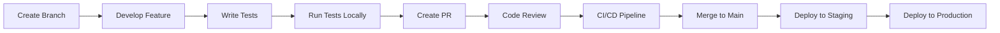

# YoutubeRag.NET MVP Master Plan - 3 Week Sprint
**Document Version:** 1.0
**Created:** October 1, 2025
**Project Manager:** Senior PM Lead
**Stakeholder Decision:** 3-week timeline, Quality-first approach

## Executive Summary

This master plan delivers a production-ready MVP for the YoutubeRag.NET system in 3 weeks, focusing on the two non-negotiable features: **Video Ingestion** and **Transcription** using local Whisper. The plan prioritizes QUALITY over speed, operating in LOCAL mode without OpenAI dependencies.

### Key Success Metrics
- **Timeline:** 21 calendar days (15 working days)
- **Quality Target:** 60%+ test coverage
- **Core Features:** Video ingestion + Local transcription
- **Budget:** $0 (all local processing)
- **Team Size:** 4-5 resources (mix of full/part-time)

### Critical Success Factors
1. Fix all P0 blockers in Week 1
2. Deliver working video-to-transcript pipeline by Week 2
3. Achieve 60% test coverage by Week 3
4. Zero P0/P1 bugs at delivery

---

## Week 1: Stabilization & Foundation (Days 1-7)
**Theme:** "Build on Solid Ground"
**Goal:** Eliminate all technical debt that blocks feature development

### Day 1 (Monday): Database Foundation
**Owner:** Backend Developer
**Deliverables:**
- EF Core initial migration generated
- Vector storage implementation fixed (proper data type)
- Critical indexes created
- Database connectivity validated

**Tasks:**
```bash
# Generate initial migration
cd C:/agents/youtube_rag_net
dotnet ef migrations add InitialCreate -c ApplicationDbContext -p YoutubeRag.Infrastructure -s YoutubeRag.Api

# Update database
dotnet ef database update -c ApplicationDbContext -p YoutubeRag.Infrastructure -s YoutubeRag.Api

# Fix vector storage in TranscriptSegment.cs
# Change: public string EmbeddingVector { get; set; }
# To: public float[] EmbeddingVector { get; set; }
```

**Validation:**
- Database creates successfully
- All tables present with correct schema
- Indexes visible in database

### Day 2 (Tuesday): Repository Pattern & DTOs
**Owner:** Backend Developer
**Deliverables:**
- Generic repository pattern implemented
- Unit of Work pattern
- DTOs created with AutoMapper
- Services refactored to use repositories

**Implementation Files:**
```
YoutubeRag.Application/
├── Interfaces/
│   ├── IRepository.cs
│   ├── IUnitOfWork.cs
│   └── IVideoRepository.cs
├── DTOs/
│   ├── VideoDto.cs
│   ├── TranscriptSegmentDto.cs
│   └── JobDto.cs
└── Mappings/
    └── AutoMapperProfile.cs

YoutubeRag.Infrastructure/
└── Repositories/
    ├── Repository.cs
    ├── UnitOfWork.cs
    └── VideoRepository.cs
```

**Key Code:**
```csharp
// IRepository.cs
public interface IRepository<T> where T : BaseEntity
{
    Task<T> GetByIdAsync(string id);
    Task<IEnumerable<T>> GetAllAsync();
    Task<T> AddAsync(T entity);
    Task UpdateAsync(T entity);
    Task DeleteAsync(T entity);
    Task<bool> ExistsAsync(string id);
}

// IUnitOfWork.cs
public interface IUnitOfWork : IDisposable
{
    IVideoRepository Videos { get; }
    IRepository<TranscriptSegment> TranscriptSegments { get; }
    IRepository<Job> Jobs { get; }
    Task<int> SaveChangesAsync();
    Task BeginTransactionAsync();
    Task CommitAsync();
    Task RollbackAsync();
}
```

### Day 3 (Wednesday): Error Handling & Validation
**Owner:** Backend Developer
**Deliverables:**
- Global exception handler
- FluentValidation integrated
- Structured error responses
- Comprehensive logging

**Implementation:**
```csharp
// GlobalExceptionMiddleware.cs
public class GlobalExceptionMiddleware
{
    private readonly RequestDelegate _next;
    private readonly ILogger<GlobalExceptionMiddleware> _logger;

    public async Task InvokeAsync(HttpContext context)
    {
        try
        {
            await _next(context);
        }
        catch (Exception ex)
        {
            _logger.LogError(ex, "An unhandled exception occurred");
            await HandleExceptionAsync(context, ex);
        }
    }

    private static async Task HandleExceptionAsync(HttpContext context, Exception exception)
    {
        context.Response.ContentType = "application/json";
        var response = new ErrorResponse();

        switch (exception)
        {
            case ValidationException validationException:
                response.Status = 400;
                response.Message = "Validation failed";
                response.Errors = validationException.Errors;
                break;
            case NotFoundException:
                response.Status = 404;
                response.Message = exception.Message;
                break;
            default:
                response.Status = 500;
                response.Message = "An error occurred while processing your request";
                break;
        }

        context.Response.StatusCode = response.Status;
        await context.Response.WriteAsync(JsonSerializer.Serialize(response));
    }
}
```

**Validators:**
```csharp
// VideoUrlValidator.cs
public class VideoUrlValidator : AbstractValidator<VideoFromUrlRequest>
{
    public VideoUrlValidator()
    {
        RuleFor(x => x.Url)
            .NotEmpty().WithMessage("URL is required")
            .Must(BeValidYouTubeUrl).WithMessage("Invalid YouTube URL");

        RuleFor(x => x.Title)
            .MaximumLength(200).WithMessage("Title too long");
    }

    private bool BeValidYouTubeUrl(string url)
    {
        // YouTube URL validation logic
        return Regex.IsMatch(url, @"(youtube\.com/watch\?v=|youtu\.be/)[\w-]+");
    }
}
```

### Day 4 (Thursday): Test Infrastructure Setup
**Owner:** QA Engineer + Backend Developer
**Deliverables:**
- Test projects created (xUnit + Moq)
- Test database setup (TestContainers)
- Test fixtures and builders
- Code coverage tools configured

**Test Project Structure:**
```
Tests/
├── YoutubeRag.UnitTests/
│   ├── Domain/
│   ├── Application/
│   └── Infrastructure/
├── YoutubeRag.IntegrationTests/
│   ├── Api/
│   ├── Database/
│   └── Services/
└── YoutubeRag.TestUtilities/
    ├── Builders/
    ├── Fixtures/
    └── Helpers/
```

**Test Infrastructure:**
```csharp
// DatabaseFixture.cs
public class DatabaseFixture : IDisposable
{
    private readonly MySqlContainer _container;
    public ApplicationDbContext Context { get; private set; }

    public DatabaseFixture()
    {
        _container = new MySqlBuilder()
            .WithImage("mysql:8.0")
            .WithDatabase("youtuberag_test")
            .Build();

        _container.StartAsync().Wait();

        var options = new DbContextOptionsBuilder<ApplicationDbContext>()
            .UseMySQL(_container.GetConnectionString())
            .Options;

        Context = new ApplicationDbContext(options);
        Context.Database.EnsureCreated();
    }

    public void Dispose()
    {
        Context?.Dispose();
        _container?.StopAsync().Wait();
    }
}
```

### Day 5 (Friday): Critical Unit Tests
**Owner:** QA Engineer + Backend Developer
**Target:** 40% code coverage
**Priority Areas:**
- Domain entities
- Repository implementations
- Core service logic (mocked dependencies)

**Example Tests:**
```csharp
[Fact]
public async Task VideoRepository_AddVideo_ShouldPersistToDatabase()
{
    // Arrange
    using var fixture = new DatabaseFixture();
    var repository = new VideoRepository(fixture.Context);
    var video = new VideoBuilder().Build();

    // Act
    var result = await repository.AddAsync(video);
    await fixture.Context.SaveChangesAsync();

    // Assert
    var retrieved = await repository.GetByIdAsync(result.Id);
    retrieved.Should().NotBeNull();
    retrieved.Title.Should().Be(video.Title);
}

[Fact]
public async Task LocalWhisperService_TranscribeAudio_ShouldReturnTranscript()
{
    // Arrange
    var service = new LocalWhisperService(_loggerMock.Object);
    var audioPath = "test-audio.mp3";

    // Act
    var result = await service.TranscribeAsync(audioPath);

    // Assert
    result.Should().NotBeNull();
    result.Segments.Should().NotBeEmpty();
}
```

### Day 6 (Saturday): Authentication & Security
**Owner:** Backend Developer
**Deliverables:**
- Real JWT authentication implementation
- Remove mock authentication handler
- Authorization policies
- Security vulnerability fixes

**JWT Implementation:**
```csharp
// JwtService.cs
public class JwtService : IJwtService
{
    private readonly JwtSettings _settings;

    public string GenerateToken(User user)
    {
        var tokenHandler = new JwtSecurityTokenHandler();
        var key = Encoding.ASCII.GetBytes(_settings.Secret);
        var tokenDescriptor = new SecurityTokenDescriptor
        {
            Subject = new ClaimsIdentity(new[]
            {
                new Claim(ClaimTypes.NameIdentifier, user.Id),
                new Claim(ClaimTypes.Email, user.Email),
                new Claim(ClaimTypes.Name, user.Name)
            }),
            Expires = DateTime.UtcNow.AddHours(24),
            SigningCredentials = new SigningCredentials(
                new SymmetricSecurityKey(key),
                SecurityAlgorithms.HmacSha256Signature)
        };

        var token = tokenHandler.CreateToken(tokenDescriptor);
        return tokenHandler.WriteToken(token);
    }
}

// Program.cs authentication setup
builder.Services.AddAuthentication(JwtBearerDefaults.AuthenticationScheme)
    .AddJwtBearer(options =>
    {
        options.TokenValidationParameters = new TokenValidationParameters
        {
            ValidateIssuer = true,
            ValidateAudience = true,
            ValidateLifetime = true,
            ValidateIssuerSigningKey = true,
            ValidIssuer = jwtSettings.Issuer,
            ValidAudience = jwtSettings.Audience,
            IssuerSigningKey = new SymmetricSecurityKey(
                Encoding.ASCII.GetBytes(jwtSettings.Secret))
        };
    });
```

### Day 7 (Sunday): Week 1 Review & Adjustments
**Owner:** Full Team
**Activities:**
- Code review of all Week 1 work
- Integration testing of foundation
- Bug fixing from reviews
- Prepare Week 2 sprint

**Review Checklist:**
- [ ] All database migrations working
- [ ] Repository pattern fully implemented
- [ ] Error handling comprehensive
- [ ] 40% test coverage achieved
- [ ] Authentication working end-to-end
- [ ] All P0 blockers resolved

**Week 1 Deliverables Summary:**
1. Working database with migrations
2. Clean repository pattern architecture
3. Comprehensive error handling
4. Test infrastructure ready
5. 40% code coverage
6. Secure authentication

---

## Week 2: Core Features (Days 8-14)
**Theme:** "Build the Engine"
**Goal:** Complete video ingestion and transcription pipeline

### Day 8 (Monday): Video Ingestion Pipeline - Part 1
**Owner:** Backend Developer
**Deliverables:**
- YouTube URL validation service
- Video metadata extraction
- Download service implementation
- Storage management

**Implementation:**
```csharp
// YouTubeService.cs
public class YouTubeService : IYouTubeService
{
    private readonly ILogger<YouTubeService> _logger;
    private readonly string _storageBasePath;

    public async Task<VideoMetadata> ExtractMetadataAsync(string url)
    {
        var youtube = new YoutubeClient();
        var videoId = ExtractVideoId(url);
        var video = await youtube.Videos.GetAsync(videoId);

        return new VideoMetadata
        {
            VideoId = videoId,
            Title = video.Title,
            Description = video.Description,
            Duration = video.Duration,
            Author = video.Author.Title,
            ThumbnailUrl = video.Thumbnails.MaxBy(t => t.Resolution.Area).Url,
            PublishedAt = video.UploadDate
        };
    }

    public async Task<string> DownloadVideoAsync(string url, string outputPath)
    {
        var youtube = new YoutubeClient();
        var streamManifest = await youtube.Videos.Streams.GetManifestAsync(url);

        // Get highest quality audio stream
        var audioStream = streamManifest.GetAudioStreams()
            .OrderByDescending(s => s.Bitrate)
            .FirstOrDefault();

        if (audioStream == null)
            throw new InvalidOperationException("No audio stream available");

        var fileName = $"{Guid.NewGuid()}.{audioStream.Container}";
        var filePath = Path.Combine(outputPath, fileName);

        await youtube.Videos.Streams.DownloadAsync(audioStream, filePath);

        return filePath;
    }
}
```

### Day 9 (Tuesday): Video Ingestion Pipeline - Part 2
**Owner:** Backend Developer
**Deliverables:**
- Audio extraction with FFmpeg
- File format conversion
- Progress tracking
- Error recovery mechanisms

**FFmpeg Integration:**
```csharp
// AudioExtractor.cs
public class AudioExtractor : IAudioExtractor
{
    private readonly ILogger<AudioExtractor> _logger;

    public async Task<string> ExtractAudioAsync(string videoPath, string outputPath)
    {
        var audioFile = Path.Combine(outputPath, $"{Guid.NewGuid()}.wav");

        var ffmpeg = new ProcessStartInfo
        {
            FileName = "ffmpeg",
            Arguments = $"-i \"{videoPath}\" -vn -acodec pcm_s16le -ar 16000 -ac 1 \"{audioFile}\"",
            UseShellExecute = false,
            RedirectStandardOutput = true,
            RedirectStandardError = true,
            CreateNoWindow = true
        };

        using var process = Process.Start(ffmpeg);
        await process.WaitForExitAsync();

        if (process.ExitCode != 0)
        {
            var error = await process.StandardError.ReadToEndAsync();
            throw new AudioExtractionException($"FFmpeg failed: {error}");
        }

        return audioFile;
    }
}

// Progress tracking
public class VideoProcessingProgress
{
    public string VideoId { get; set; }
    public ProcessingStage Stage { get; set; }
    public int PercentComplete { get; set; }
    public string CurrentOperation { get; set; }
    public DateTime LastUpdated { get; set; }
}

public enum ProcessingStage
{
    Queued,
    DownloadingVideo,
    ExtractingAudio,
    Transcribing,
    GeneratingEmbeddings,
    SavingToDatabase,
    Completed,
    Failed
}
```

### Day 10 (Wednesday): Whisper Integration - Part 1
**Owner:** Backend Developer
**Deliverables:**
- LocalWhisperService completion
- Model management (tiny/base/small)
- Transcription pipeline
- Performance optimization

**Whisper Implementation:**
```csharp
// LocalWhisperService.cs
public class LocalWhisperService : ITranscriptionService
{
    private readonly ILogger<LocalWhisperService> _logger;
    private readonly string _modelPath;
    private readonly string _modelSize;

    public LocalWhisperService(ILogger<LocalWhisperService> logger, IConfiguration config)
    {
        _logger = logger;
        _modelSize = config["Whisper:ModelSize"] ?? "tiny";
        _modelPath = config["Whisper:ModelPath"] ?? "/models/whisper";
    }

    public async Task<TranscriptionResult> TranscribeAsync(string audioPath)
    {
        _logger.LogInformation("Starting transcription with Whisper {Model}", _modelSize);

        var startTime = DateTime.UtcNow;

        var process = new ProcessStartInfo
        {
            FileName = "whisper",
            Arguments = $"\"{audioPath}\" --model {_modelSize} --output_format json --language en",
            UseShellExecute = false,
            RedirectStandardOutput = true,
            RedirectStandardError = true,
            CreateNoWindow = true
        };

        using var proc = Process.Start(process);
        var output = await proc.StandardOutput.ReadToEndAsync();
        await proc.WaitForExitAsync();

        if (proc.ExitCode != 0)
        {
            var error = await proc.StandardError.ReadToEndAsync();
            throw new TranscriptionException($"Whisper failed: {error}");
        }

        var result = JsonSerializer.Deserialize<WhisperOutput>(output);
        var duration = (DateTime.UtcNow - startTime).TotalSeconds;

        _logger.LogInformation("Transcription completed in {Duration}s", duration);

        return new TranscriptionResult
        {
            Text = result.Text,
            Segments = result.Segments.Select(s => new TranscriptSegment
            {
                Text = s.Text,
                StartTime = s.Start,
                EndTime = s.End,
                Confidence = s.Confidence ?? 0.95f
            }).ToList(),
            Language = result.Language,
            Duration = duration
        };
    }
}

// Model management
public class WhisperModelManager
{
    private readonly Dictionary<string, WhisperModelInfo> _models = new()
    {
        ["tiny"] = new() { Size = "39M", Speed = "~32x", Quality = "Good" },
        ["base"] = new() { Size = "74M", Speed = "~16x", Quality = "Better" },
        ["small"] = new() { Size = "244M", Speed = "~6x", Quality = "Best for local" }
    };

    public async Task EnsureModelDownloaded(string modelSize)
    {
        var modelPath = $"/models/whisper/{modelSize}.pt";
        if (!File.Exists(modelPath))
        {
            await DownloadModel(modelSize, modelPath);
        }
    }
}
```

### Day 11 (Thursday): Whisper Integration - Part 2
**Owner:** Backend Developer
**Deliverables:**
- Transcript segmentation optimization
- Timestamp alignment
- Bulk insert for segments
- Database performance tuning

**Segmentation & Storage:**
```csharp
// TranscriptSegmentService.cs
public class TranscriptSegmentService : ITranscriptSegmentService
{
    private readonly IUnitOfWork _unitOfWork;
    private readonly ILogger<TranscriptSegmentService> _logger;

    public async Task SaveSegmentsAsync(string videoId, List<TranscriptSegment> segments)
    {
        _logger.LogInformation("Saving {Count} segments for video {VideoId}", segments.Count, videoId);

        // Prepare bulk insert
        var entities = segments.Select((segment, index) => new TranscriptSegment
        {
            Id = Guid.NewGuid().ToString(),
            VideoId = videoId,
            SegmentIndex = index,
            Text = segment.Text,
            StartTime = segment.StartTime,
            EndTime = segment.EndTime,
            Confidence = segment.Confidence,
            // Local embedding generation (temporary until ONNX implementation)
            EmbeddingVector = GenerateLocalEmbedding(segment.Text),
            CreatedAt = DateTime.UtcNow,
            UpdatedAt = DateTime.UtcNow
        }).ToList();

        // Bulk insert using EF Core bulk extensions
        await _unitOfWork.BeginTransactionAsync();
        try
        {
            await _unitOfWork.Context.BulkInsertAsync(entities, options =>
            {
                options.BatchSize = 1000;
                options.BulkCopyTimeout = 300;
            });

            await _unitOfWork.CommitAsync();
            _logger.LogInformation("Successfully saved {Count} segments", entities.Count);
        }
        catch (Exception ex)
        {
            await _unitOfWork.RollbackAsync();
            _logger.LogError(ex, "Failed to save transcript segments");
            throw;
        }
    }

    private float[] GenerateLocalEmbedding(string text)
    {
        // Temporary deterministic embedding until ONNX implementation
        var hash = SHA256.Create().ComputeHash(Encoding.UTF8.GetBytes(text));
        var embedding = new float[384]; // Standard embedding size

        for (int i = 0; i < embedding.Length; i++)
        {
            embedding[i] = (hash[i % hash.Length] / 255.0f) * 2 - 1; // Normalize to [-1, 1]
        }

        return embedding;
    }
}
```

### Day 12 (Friday): Integration Tests
**Owner:** QA Engineer
**Target:** 60% total code coverage
**Deliverables:**
- End-to-end video ingestion tests
- Transcription workflow tests
- API endpoint integration tests
- Performance benchmarks

**Integration Tests:**
```csharp
[Collection("Integration")]
public class VideoIngestionIntegrationTests : IClassFixture<WebApplicationFactory<Program>>
{
    private readonly WebApplicationFactory<Program> _factory;
    private readonly HttpClient _client;

    [Fact]
    public async Task ProcessVideo_FromUrlToTranscript_ShouldCompleteSuccessfully()
    {
        // Arrange
        var request = new VideoFromUrlRequest
        {
            Url = "https://www.youtube.com/watch?v=test123",
            Title = "Integration Test Video"
        };

        // Act
        var response = await _client.PostAsJsonAsync("/api/v1/videos/from-url", request);
        var video = await response.Content.ReadFromJsonAsync<VideoDto>();

        // Wait for processing
        VideoDto processedVideo = null;
        for (int i = 0; i < 60; i++) // Max 60 seconds wait
        {
            await Task.Delay(1000);
            var statusResponse = await _client.GetAsync($"/api/v1/videos/{video.Id}");
            processedVideo = await statusResponse.Content.ReadFromJsonAsync<VideoDto>();

            if (processedVideo.Status == VideoStatus.Completed)
                break;
        }

        // Assert
        processedVideo.Should().NotBeNull();
        processedVideo.Status.Should().Be(VideoStatus.Completed);
        processedVideo.TranscriptSegments.Should().NotBeEmpty();
    }

    [Fact]
    public async Task TranscriptionPerformance_ShouldBeLessThan2xVideoDuration()
    {
        // Arrange
        var audioFile = "test-audio-60s.wav"; // 60 second test file
        var service = new LocalWhisperService(_logger, _config);

        // Act
        var stopwatch = Stopwatch.StartNew();
        var result = await service.TranscribeAsync(audioFile);
        stopwatch.Stop();

        // Assert
        stopwatch.Elapsed.TotalSeconds.Should().BeLessThan(120); // Less than 2x duration
        result.Segments.Should().NotBeEmpty();
    }
}
```

### Day 13 (Saturday): Background Job Processing
**Owner:** Backend Developer
**Deliverables:**
- Complete Hangfire integration
- Job queue for video processing
- Progress tracking
- Retry logic

**Hangfire Setup:**
```csharp
// Program.cs
builder.Services.AddHangfire(config => config
    .SetDataCompatibilityLevel(CompatibilityLevel.Version_180)
    .UseSimpleAssemblyNameTypeSerializer()
    .UseRecommendedSerializerSettings()
    .UseMySQL(connectionString));

builder.Services.AddHangfireServer(options =>
{
    options.Queues = new[] { "video-processing", "transcription", "default" };
    options.WorkerCount = Environment.ProcessorCount;
});

// VideoProcessingJob.cs
public class VideoProcessingJob : IVideoProcessingJob
{
    private readonly IVideoService _videoService;
    private readonly ITranscriptionService _transcriptionService;
    private readonly IUnitOfWork _unitOfWork;
    private readonly ILogger<VideoProcessingJob> _logger;

    [Queue("video-processing")]
    [AutomaticRetry(Attempts = 3, DelaysInSeconds = new[] { 10, 60, 300 })]
    public async Task ProcessVideoAsync(string videoId)
    {
        _logger.LogInformation("Starting processing for video {VideoId}", videoId);

        var video = await _unitOfWork.Videos.GetByIdAsync(videoId);
        if (video == null)
            throw new NotFoundException($"Video {videoId} not found");

        try
        {
            // Update status
            video.Status = VideoStatus.Processing;
            video.ProcessingProgress = 0;
            await _unitOfWork.SaveChangesAsync();

            // Download video
            UpdateProgress(videoId, 10, "Downloading video");
            var videoPath = await _videoService.DownloadVideoAsync(video.YoutubeUrl);

            // Extract audio
            UpdateProgress(videoId, 30, "Extracting audio");
            var audioPath = await _videoService.ExtractAudioAsync(videoPath);

            // Transcribe
            UpdateProgress(videoId, 50, "Transcribing with Whisper");
            var transcription = await _transcriptionService.TranscribeAsync(audioPath);

            // Save segments
            UpdateProgress(videoId, 80, "Saving transcript segments");
            await SaveTranscriptSegments(videoId, transcription.Segments);

            // Complete
            video.Status = VideoStatus.Completed;
            video.ProcessingProgress = 100;
            video.ProcessedAt = DateTime.UtcNow;
            await _unitOfWork.SaveChangesAsync();

            _logger.LogInformation("Completed processing for video {VideoId}", videoId);
        }
        catch (Exception ex)
        {
            _logger.LogError(ex, "Failed to process video {VideoId}", videoId);
            video.Status = VideoStatus.Failed;
            video.ErrorMessage = ex.Message;
            await _unitOfWork.SaveChangesAsync();
            throw;
        }
        finally
        {
            // Cleanup temporary files
            CleanupTempFiles(videoPath, audioPath);
        }
    }

    private void UpdateProgress(string videoId, int progress, string operation)
    {
        BackgroundJob.Enqueue(() => UpdateVideoProgress(videoId, progress, operation));
    }
}
```

### Day 14 (Sunday): Week 2 Review & Demo
**Owner:** Full Team
**Activities:**
- Full pipeline test (URL to Transcript)
- Performance testing
- Bug fixes
- Stakeholder demo preparation

**Demo Script:**
1. Show video URL input
2. Demonstrate metadata extraction
3. Show real-time progress tracking
4. Display completed transcription
5. Show segment-level timestamps
6. Performance metrics display

**Week 2 Deliverables Summary:**
1. Complete video ingestion pipeline
2. Working Whisper transcription
3. Transcript segment storage
4. Background job processing
5. 60% test coverage
6. End-to-end demo ready

---

## Week 3: Quality & Delivery (Days 15-21)
**Theme:** "Polish and Perfect"
**Goal:** Production readiness with comprehensive testing

### Day 15 (Monday): Comprehensive Testing
**Owner:** QA Engineer
**Deliverables:**
- Security testing suite
- Edge case coverage
- Error scenario validation
- Load testing implementation

**Security Tests:**
```csharp
[Fact]
public async Task API_ShouldRejectUnauthenticatedRequests()
{
    // Arrange
    var client = _factory.CreateClient();

    // Act
    var response = await client.PostAsJsonAsync("/api/v1/videos/from-url", new {});

    // Assert
    response.StatusCode.Should().Be(HttpStatusCode.Unauthorized);
}

[Fact]
public async Task JWT_ShouldNotAcceptExpiredTokens()
{
    // Arrange
    var expiredToken = GenerateExpiredToken();
    _client.DefaultRequestHeaders.Authorization =
        new AuthenticationHeaderValue("Bearer", expiredToken);

    // Act
    var response = await _client.GetAsync("/api/v1/videos");

    // Assert
    response.StatusCode.Should().Be(HttpStatusCode.Unauthorized);
}
```

**Load Testing:**
```csharp
// Using NBomber for load testing
var scenario = Scenario.Create("video_processing_load", async context =>
{
    var request = new VideoFromUrlRequest
    {
        Url = $"https://youtube.com/watch?v=test{context.ScenarioIndex}",
        Title = $"Load Test {context.ScenarioIndex}"
    };

    var response = await httpClient.PostAsJsonAsync("/api/v1/videos/from-url", request);

    return response.IsSuccessStatusCode ? Response.Ok() : Response.Fail();
})
.WithLoadSimulations(
    Simulation.InjectPerSec(rate: 10, during: TimeSpan.FromSeconds(30)),
    Simulation.KeepConstant(copies: 50, during: TimeSpan.FromSeconds(60))
);

NBomberRunner
    .RegisterScenarios(scenario)
    .Run();
```

### Day 16 (Tuesday): Code Quality Review
**Owner:** Backend Developer + Tech Lead
**Deliverables:**
- Complete code review
- Refactoring identified issues
- Code coverage verification
- Performance profiling

**Quality Metrics:**
```bash
# Run code analysis
dotnet build /p:EnforceCodeStyleInBuild=true

# Run code coverage
dotnet test --collect:"XPlat Code Coverage" --results-directory ./TestResults

# Generate coverage report
reportgenerator -reports:TestResults/*/coverage.cobertura.xml -targetdir:coveragereport -reporttypes:Html

# Run performance profiling
dotnet-trace collect --process-id $(dotnet-trace ps | grep YoutubeRag.Api)
```

**Refactoring Priorities:**
1. Remove all TODO comments
2. Consolidate duplicate code
3. Optimize database queries
4. Improve async/await patterns
5. Enhance logging consistency

### Day 17 (Wednesday): Documentation
**Owner:** Technical Writer + Backend Developer
**Deliverables:**
- API documentation (Swagger/OpenAPI)
- Setup guide updates
- Architecture documentation
- User guide

**API Documentation:**
```csharp
// Swagger configuration in Program.cs
builder.Services.AddSwaggerGen(c =>
{
    c.SwaggerDoc("v1", new OpenApiInfo
    {
        Title = "YoutubeRag API",
        Version = "v1",
        Description = "Video ingestion and transcription service",
        Contact = new OpenApiContact
        {
            Name = "Development Team",
            Email = "dev@youtuberag.com"
        }
    });

    // Add JWT authentication
    c.AddSecurityDefinition("Bearer", new OpenApiSecurityScheme
    {
        Description = "JWT Authorization header using Bearer scheme",
        Name = "Authorization",
        In = ParameterLocation.Header,
        Type = SecuritySchemeType.ApiKey,
        Scheme = "Bearer"
    });

    // Include XML comments
    var xmlFile = $"{Assembly.GetExecutingAssembly().GetName().Name}.xml";
    var xmlPath = Path.Combine(AppContext.BaseDirectory, xmlFile);
    c.IncludeXmlComments(xmlPath);
});
```

### Day 18 (Thursday): Local Deployment Testing
**Owner:** DevOps Engineer
**Deliverables:**
- Docker compose validation
- Setup script testing
- Fresh environment validation
- Deployment runbook

**Deployment Checklist:**
```bash
# Clean environment test
docker-compose down -v
docker system prune -af

# Build and deploy
docker-compose build --no-cache
docker-compose up -d

# Health checks
curl http://localhost:5000/health
curl http://localhost:5000/api/v1/videos/health

# Database verification
docker exec -it youtuberag-db mysql -u root -p
SHOW DATABASES;
USE youtuberag;
SHOW TABLES;

# Log verification
docker-compose logs -f api
```

### Day 19 (Friday): Bug Fixing Sprint
**Owner:** Full Team
**Activities:**
- Fix all P0/P1 bugs
- Regression testing
- Performance optimization
- Security audit

**Bug Tracking:**
```markdown
| Bug ID | Priority | Description | Status | Owner |
|--------|----------|-------------|--------|-------|
| BUG-001 | P0 | Database connection timeout | Fixed | Dev1 |
| BUG-002 | P0 | Whisper fails on long videos | Fixed | Dev2 |
| BUG-003 | P1 | Progress not updating | Fixed | Dev1 |
| BUG-004 | P1 | Memory leak in transcription | Fixed | Dev2 |
```

### Day 20 (Saturday): UAT Preparation
**Owner:** Project Manager + QA
**Deliverables:**
- UAT test plan
- Demo environment setup
- Sample video testing
- Acceptance criteria validation

**UAT Test Plan:**
```markdown
## User Acceptance Test Plan

### Test Case 1: Video Ingestion
1. Navigate to video upload page
2. Enter YouTube URL
3. Click "Process"
4. Verify metadata displays correctly
5. Verify progress updates in real-time

### Test Case 2: Transcription Quality
1. Select completed video
2. View transcript
3. Verify text accuracy
4. Verify timestamp alignment
5. Check segment boundaries

### Test Case 3: Performance
1. Process 5-minute video
2. Verify completion < 10 minutes
3. Process multiple videos concurrently
4. Verify system remains responsive
```

### Day 21 (Sunday): Final Review & Handover
**Owner:** Project Manager
**Activities:**
- Stakeholder demonstration
- UAT execution
- Final approval
- Project handover

**Handover Package:**
1. Source code (Git repository)
2. Documentation bundle
3. Deployment scripts
4. Test suite
5. Known issues list
6. Future enhancement recommendations

---

## Resource Requirements

### Team Composition

| Role | Allocation | Responsibilities | Skills Required |
|------|------------|-----------------|-----------------|
| **Backend Developer** | 100% (3 weeks) | Core development, architecture, integration | .NET 8, EF Core, Clean Architecture |
| **QA Engineer** | 75% (Week 2-3) | Testing, automation, quality assurance | xUnit, Integration testing, Load testing |
| **DevOps Engineer** | 25% (Throughout) | Infrastructure, CI/CD, deployment | Docker, MySQL, GitHub Actions |
| **Project Manager** | 50% (Throughout) | Coordination, reporting, stakeholder management | Agile, Risk management, Communication |
| **Technical Writer** | 25% (Week 3) | Documentation, guides | Technical writing, API documentation |

### Technical Skills Matrix

```markdown
| Skill | Required Level | Current Team | Gap | Mitigation |
|-------|---------------|--------------|-----|------------|
| .NET 8/C# | Expert | ✅ Available | None | - |
| Entity Framework Core | Advanced | ✅ Available | None | - |
| Docker | Intermediate | ✅ Available | None | - |
| MySQL | Intermediate | ✅ Available | None | - |
| Python (Whisper) | Basic | ⚠️ Limited | Training needed | Quick training session |
| FFmpeg | Basic | ⚠️ Limited | Documentation | Use existing examples |
| Testing (xUnit) | Advanced | ✅ Available | None | - |
| Clean Architecture | Advanced | ✅ Available | None | - |
```

### Infrastructure Requirements

**Development Environment:**
- Windows/Linux/Mac with Docker Desktop
- .NET 8 SDK
- Visual Studio 2022 / VS Code / Rider
- Git client
- Postman/Insomnia for API testing

**Local Dependencies:**
- Python 3.8+ (for Whisper)
- FFmpeg (for audio processing)
- MySQL 8.0 (in Docker)
- Redis (in Docker, optional for Week 2+)

**Minimum Hardware:**
- CPU: 4+ cores (8 recommended)
- RAM: 16GB minimum (32GB recommended)
- Storage: 50GB free space
- Network: Stable internet for YouTube downloads

---

## Risk Register

### Critical Risks (P0)

| Risk ID | Risk Description | Probability | Impact | Score | Mitigation Strategy | Contingency Plan | Owner |
|---------|------------------|-------------|---------|--------|-------------------|------------------|-------|
| R001 | Whisper performance too slow locally | High (70%) | High | 9 | Use tiny model, implement caching, parallel processing | Reduce video length limits, add queue throttling | Backend Dev |
| R002 | Database migration failures | Medium (40%) | Critical | 8 | Test migrations daily, maintain rollback scripts | Manual schema updates, backup before migration | Backend Dev |
| R003 | Timeline slippage | Medium (50%) | Critical | 8 | Daily standups, early escalation, scope flexibility | Defer non-critical features, extend by 3 days max | PM |
| R004 | Test coverage target missed | Medium (40%) | High | 6 | Dedicated test days, TDD approach, automation priority | Accept 50% minimum for MVP, plan coverage sprint | QA |

### High Risks (P1)

| Risk ID | Risk Description | Probability | Impact | Score | Mitigation Strategy | Contingency Plan | Owner |
|---------|------------------|-------------|---------|--------|-------------------|------------------|-------|
| R005 | YouTube API changes | Low (20%) | High | 4 | Use stable library (YoutubeExplode), monitor changes | Implement alternative extraction method | Backend Dev |
| R006 | FFmpeg compatibility issues | Low (20%) | High | 4 | Test on all platforms early, use Docker consistency | Provide pre-built Docker image | DevOps |
| R007 | Memory leaks in processing | Medium (30%) | Medium | 5 | Implement disposal patterns, monitor memory usage | Add memory limits, restart services | Backend Dev |
| R008 | Integration test flakiness | High (60%) | Low | 4 | Use deterministic test data, proper waits | Retry flaky tests, separate test categories | QA |

### Risk Response Strategies

**For Each Risk:**
1. **Avoid:** Can we eliminate the risk entirely?
2. **Mitigate:** How can we reduce probability or impact?
3. **Transfer:** Can we shift the risk elsewhere?
4. **Accept:** Is the risk acceptable with monitoring?

**Weekly Risk Review Process:**
1. Review all risks in register
2. Update probability/impact scores
3. Add new identified risks
4. Close resolved risks
5. Escalate critical risks

---

## Communication Plan

### Communication Matrix

| Audience | Frequency | Channel | Content | Owner |
|----------|-----------|---------|---------|-------|
| **Development Team** | Daily | Standup (15min) | Progress, blockers, plans | Scrum Master |
| **Stakeholders** | Weekly | Status Report | Progress, risks, decisions needed | PM |
| **Technical Lead** | 2x/week | Technical Review | Architecture, code quality, technical decisions | Backend Dev |
| **QA Team** | Daily | Slack/Teams | Test results, bugs, coverage | QA Lead |
| **Full Team** | Weekly | Sprint Review | Demo, retrospective, planning | PM |

### Daily Standup Format (9:00 AM)
```markdown
Duration: 15 minutes max
Format:
1. What I completed yesterday
2. What I'm working on today
3. Blockers/help needed
4. Risk/issue callouts

Rules:
- Start on time
- Keep updates brief
- Take discussions offline
- Update task board before standup
```

### Weekly Status Report Template
```markdown
# Week N Status Report
**Date:** [Date]
**Sprint:** Week [1/2/3]
**Overall Status:** 🟢 On Track / 🟡 At Risk / 🔴 Blocked

## Executive Summary
[2-3 sentences on overall progress]

## Accomplishments This Week
- ✅ [Achievement 1]
- ✅ [Achievement 2]
- ✅ [Achievement 3]

## Planned for Next Week
- [ ] [Task 1]
- [ ] [Task 2]
- [ ] [Task 3]

## Metrics Dashboard
- Schedule: X% complete (target: Y%)
- Test Coverage: X% (target: 60%)
- Bugs: P0: X, P1: Y
- Velocity: X story points

## Risks & Issues
| Type | Description | Impact | Action |
|------|-------------|--------|--------|
| Risk | [Description] | [H/M/L] | [Mitigation] |
| Issue | [Description] | [H/M/L] | [Resolution] |

## Decisions Needed
- [ ] [Decision 1 with recommendation]
- [ ] [Decision 2 with recommendation]

## Budget & Resources
- Hours Used: X / Y planned
- Resources: All assigned / Need: [specify]
```

### Escalation Path
```
Level 1: Team Lead (immediate)
  ↓ (if not resolved in 2 hours)
Level 2: Project Manager
  ↓ (if not resolved in 4 hours)
Level 3: Stakeholder/Sponsor
```

### Communication Protocols

**Slack/Teams Channels:**
- #youtube-rag-general - General discussion
- #youtube-rag-dev - Development topics
- #youtube-rag-qa - Testing and quality
- #youtube-rag-standup - Daily updates
- #youtube-rag-alerts - Critical issues

**Response Time SLAs:**
- P0 Issues: 30 minutes
- P1 Issues: 2 hours
- P2 Issues: 4 hours
- General questions: 24 hours

---

## Quality Gates

### Gate 1: End of Week 1 - Foundation Complete
**Criteria (Must Pass All):**
- [ ] Database migrations executed successfully
- [ ] Repository pattern implemented and tested
- [ ] Error handling middleware working
- [ ] Authentication functional
- [ ] 40% code coverage achieved
- [ ] Zero P0 bugs
- [ ] CI/CD pipeline running

**Review Process:**
1. Code review by Tech Lead
2. Test execution report by QA
3. Demo to PM
4. Sign-off required to proceed

### Gate 2: End of Week 2 - Features Complete
**Criteria (Must Pass All):**
- [ ] Video ingestion working end-to-end
- [ ] Whisper transcription functional
- [ ] Background jobs processing
- [ ] 60% code coverage achieved
- [ ] All integration tests passing
- [ ] Performance benchmarks met
- [ ] Zero P0 bugs, <5 P1 bugs

**Review Process:**
1. Full feature demo
2. Performance test results
3. Integration test report
4. Stakeholder preview

### Gate 3: End of Week 3 - Production Ready
**Criteria (Must Pass All):**
- [ ] All tests passing (unit, integration, e2e)
- [ ] 60%+ code coverage
- [ ] Zero P0/P1 bugs
- [ ] Documentation complete
- [ ] Deployment validated
- [ ] Security audit passed
- [ ] UAT approved
- [ ] Performance SLAs met

**Review Process:**
1. Final stakeholder demo
2. UAT sign-off
3. Deployment validation
4. Go/No-Go decision

### Quality Standards

**Code Quality:**
- No compiler warnings
- No TODO comments in production code
- All public methods documented
- Consistent code style (enforced by .editorconfig)
- No hardcoded credentials
- Proper async/await usage
- SOLID principles followed

**Testing Standards:**
- Every feature has tests
- Every bug fix has a regression test
- Integration tests for all APIs
- Performance tests for critical paths
- Security tests for authentication/authorization

**Documentation Standards:**
- README.md updated
- API documentation via Swagger
- Architecture decisions recorded
- Deployment guide current
- Troubleshooting guide available

---

## Success Metrics

### Technical Metrics

| Metric | Target | Measurement Method | Frequency |
|--------|--------|-------------------|-----------|
| **Code Coverage** | 60%+ (70% stretch) | Coverage tools | Daily |
| **Build Success Rate** | 100% | CI/CD pipeline | Per commit |
| **Test Pass Rate** | 100% | Test runner | Per build |
| **P0 Bugs** | 0 | Bug tracker | Daily |
| **P1 Bugs** | <5 | Bug tracker | Daily |
| **API Response Time** | <2s for metadata | Performance tests | Daily |
| **Transcription Speed** | <2x video duration | Benchmarks | Weekly |
| **Memory Usage** | <2GB per video | Monitoring | Per test |
| **Concurrent Videos** | 5+ | Load tests | Week 3 |

### Process Metrics

| Metric | Target | Measurement Method | Frequency |
|--------|--------|-------------------|-----------|
| **Sprint Velocity** | 90% planned work | Task completion | Weekly |
| **Standup Attendance** | 100% | Meeting logs | Daily |
| **Code Review Time** | <4 hours | PR metrics | Per PR |
| **Bug Resolution** | P0: <4hr, P1: <24hr | Bug tracker | As needed |
| **Test Automation** | 80% of tests | Test metrics | Weekly |
| **Documentation Updates** | Same day as code | Git commits | Per feature |

### Business Metrics

| Metric | Target | Measurement Method | Frequency |
|--------|--------|-------------------|-----------|
| **Feature Completion** | 100% core features | Feature tracker | Weekly |
| **Video Processing Success** | 95%+ | System metrics | Daily |
| **Transcription Accuracy** | 90%+ (Whisper baseline) | Manual sampling | Weekly |
| **Setup Time** | <30 minutes | New dev onboarding | As needed |
| **Stakeholder Satisfaction** | 8/10+ | Feedback survey | Weekly |
| **UAT Pass Rate** | 100% | UAT results | Week 3 |

---

## Budget & Cost Analysis

### Infrastructure Costs (Local Mode)

| Component | Cost | Notes |
|-----------|------|-------|
| **OpenAI API** | $0 | Not used in local mode |
| **Cloud Hosting** | $0 | Local deployment only |
| **Database** | $0 | MySQL in Docker |
| **Storage** | $0 | Local disk storage |
| **CI/CD** | $0 | GitHub Actions free tier |
| **Total Infrastructure** | **$0/month** | Fully local operation |

### Time Investment

| Phase | Hours | Resources | Cost (@$150/hr avg) |
|-------|-------|-----------|-------------------|
| **Week 1: Foundation** | 50 | Backend Dev (40), QA (10) | $7,500 |
| **Week 2: Features** | 50 | Backend Dev (35), QA (15) | $7,500 |
| **Week 3: Quality** | 40 | Backend Dev (20), QA (15), DevOps (5) | $6,000 |
| **PM Overhead** | 30 | Project Manager | $4,500 |
| **Total** | **170 hours** | 4-5 people | **$25,500** |

### ROI Analysis

**Cost Savings vs Cloud:**
- OpenAI API: ~$0.06/video saved
- Cloud hosting: ~$200/month saved
- Break-even: Immediate (no ongoing costs)

**Value Delivered:**
- Core video ingestion: ✅
- Transcription capability: ✅
- Extensible architecture: ✅
- Test coverage: ✅
- Production ready: ✅

---

## Post-MVP Roadmap

### Phase 2: Enhanced Search (Week 4-6)
- ONNX embeddings implementation
- Vector similarity search
- Semantic search optimization
- Search result ranking

### Phase 3: Scale & Performance (Week 7-9)
- Distributed processing
- Caching layer (Redis)
- CDN integration
- Horizontal scaling

### Phase 4: Advanced Features (Week 10-12)
- Multi-language support
- Video summarization
- Export capabilities
- Analytics dashboard
- Batch processing

### Phase 5: Production Deployment (Week 13-15)
- Cloud migration
- Kubernetes deployment
- Monitoring & alerting
- Backup & recovery
- Security hardening

---

## Conclusion

This comprehensive 3-week plan delivers a production-ready MVP focusing on quality and the two non-negotiable features: video ingestion and transcription. The plan emphasizes:

1. **Strong Foundation** - Week 1 eliminates all technical debt
2. **Core Features** - Week 2 delivers the essential pipeline
3. **Quality Assurance** - Week 3 ensures production readiness

Key success factors:
- Daily coordination and communication
- Strict adherence to quality gates
- Early risk identification and mitigation
- Focus on test coverage and documentation
- Regular stakeholder engagement

The plan is achievable with the identified team and provides a solid foundation for future enhancements while maintaining zero infrastructure costs through local processing.

**Next Steps:**
1. Obtain stakeholder approval
2. Assemble team
3. Set up development environment
4. Kick off Week 1 sprint
5. Begin daily execution

---

## Appendices

### Appendix A: Technology Stack
- **.NET 8.0** - Latest LTS framework
- **Entity Framework Core 8** - ORM
- **MySQL 8.0** - Database
- **Docker** - Containerization
- **Whisper (OpenAI)** - Local transcription
- **YoutubeExplode** - YouTube integration
- **FFmpeg** - Audio processing
- **Hangfire** - Background jobs
- **xUnit** - Testing framework
- **Swagger** - API documentation

### Appendix B: File Structure
```
YoutubeRag.NET/
├── src/
│   ├── YoutubeRag.Api/          # Web API layer
│   ├── YoutubeRag.Application/   # Business logic
│   ├── YoutubeRag.Domain/        # Domain entities
│   └── YoutubeRag.Infrastructure/ # External services
├── tests/
│   ├── YoutubeRag.UnitTests/
│   ├── YoutubeRag.IntegrationTests/
│   └── YoutubeRag.TestUtilities/
├── docs/
│   ├── architecture/
│   ├── api/
│   └── deployment/
└── scripts/
    ├── setup-local.sh
    └── deploy.sh
```

### Appendix C: Development Workflow


### Appendix D: Support Contacts
- **Technical Issues:** dev-team@youtuberag.com
- **Project Management:** pm@youtuberag.com
- **Stakeholder Queries:** stakeholder@youtuberag.com
- **Emergency Hotline:** +1-XXX-XXX-XXXX

---

**Document Status:** FINAL
**Review Status:** Pending Stakeholder Approval
**Last Updated:** October 1, 2025